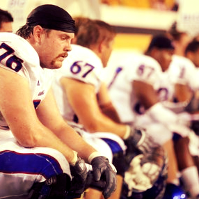

_Originally published on January 10, 2013._

Seth!

I thought about reaching out through a friend of a friend of a friend but the world wide web is more efficient than that. I wrote you this beautiful note so that you would hire me!

This job listing was on Hacker News! Woah I must be like 1 of 1000 applicants in the last hour so let’s make this interesting because lord knows you’re likely bored of cover letters. I’m Brad and I love to talk to people. Let’s cover all the bases, first and foremost, I’ve only sold 3 things officially in my life: Dairy Queen blizzards, self-designed t-shirts and myself. No, I am not a prostitute! Not only was I the face of the program to donors and the media but nothing feels like selling yourself more than during the college football and NFL recruitment process.

I’ve played football all my life, or at least since I was allowed to until no one wanted me to anymore, which was very recently with the Arizona Cardinals. Now it’s time to leverage some of those skills I learned to help another team kick ass and take names (hopefully not literally because that’s assault). My love of the statup scene has never been more evident than when I pedaled my hardly used bicycle some 215 miles to Omaha for the Silicon Prairie News Awards; I had trouble sitting for awhile but gosh darnit they remembered the crazy guy that biked there.

Aside from burying myself under piles of digitized articles I’ve found a passion for helping people out; there should be an app to notify me when somebody needs something high up they can’t reach. I was recognized by the Big XII (and Chik-fil-a) for my community service for my involvement with the Special Olympics, Habitat for Humanity and a local READ program while playing football at the University of Kansas. I was also nominated for the Bobby Bowden FCA Award and the All-State AFCA Good Works Team.

Let’s talk getting shit done. I do that. I’m not going to shove football down your throat because it’s already an overplayed card at this point, but I did make it to the NFL. Probably a little bit more difficult than that is the fact that I garnered 50 AP credits in high school, graduated with my BBA in two years and amassed over 50 masters credits while earning my masters in economics in another two years. Too bad the real world isn’t full of standardized tests, right?

Time to wrap up, I’ve babbled your ears off by now! Yes I know HTML, and sadly, no I don’t know Ruby on Rails; check out my responsive resume site built with Twitter Bootstrap. As for fundraising and grassroots organizing, try motivating a bunch of apathetic athletes who want nothing more than to sleep after a horrendously long day. As one of the most active members of the Student Athlete Advisory Committee, I was part of one of the most productive eras in the committees history. I also serenaded the athletic director shirtless with a butchered rendition of Whitney Houston’s I Will Always Love You; it’s seared into the memories of all who witnessed it. You run a startup, you take chances; take a chance on me an it’ll pay off. I guarantee it or your money back.

Happy Thursday!

Brad Thorson

P.S. — Really hoping to hear from you soon so I don’t look like this guy…

