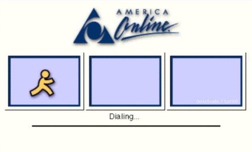

To make things easy, I’m going to write about what I’m doing right now. Since I just started working at a fairly large publisher, it should be easy to write a few hundred words about some problems we (publishers) are facing.

The Original Internet

Since the rise and fall of AOL as the center of the internet, publishing has been in constant flux. One thing that’s remained fairly constant is publishers’ hosting content within their own domains. Sure, there have been experiments, but, by and large, The New York Times content has lived on The New York Times website (and their newspapers).

Last year, The New York Times made headlines for publishing a few articles on other publishers’ domains, like [Mashable](http://www.capitalnewyork.com/article/media/2014/04/8544476/emnew-york-timesem-makes-native-ad-buys-its-own). The Times also launched some of the [most innovative sponsored content](http://adage.com/article/media/york-times-runs-native-ad-orange-black/293713/) with Netflix for Orange is the New Black. Suffice it to say, one of the world’s most reputable news sources has realized publishing is changing again.

All these words are to say, as an industry, publishing paradigms are rapidly changing. Shortly, audiences are fluid and distracted; reaching them has become a more proactive pursuit. Content needs to be dynamic both in format and location.

Wagon wheel at Black Creek Pioneer Village — wikimedia.org

So, what’s a publisher to do? My mind works best with analogies, so I like to think of the future as a bike wheel. At the center is a hub of information — text, pictures, videos, infographics — all grouped under a “story”. Back in the day, there was only one spoke, the publisher’s domain. Today, the number of spokes is constantly growing. The format of a “story” may change across Facebook, Twitter, Instagram, Pinterest, Snapchat, LinkedIn, etc. but that story is built off of the same set of components.

The future will be interesting. This model requires an entirely new perspective on the CMS, and what exactly a publisher’s mission is. BuzzFeed embraced the agency model and is now creating branded content and distributing it wherever they can find reach. The New York Times, once a paragon of stagnation, plans to directly [publish articles within Facebook](http://www.nytimes.com/2015/05/13/technology/facebook-media-venture-to-include-nbc-buzzfeed-and-new-york-times.html) via Instant Articles.

The game is afoot, but victory is still far off.