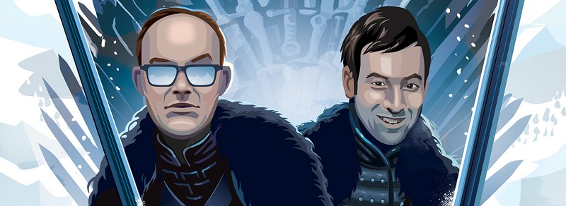

Happy Friday! Ready to get your ears tickled? Onto this week’s update:

I fucking love podcasts. Don’t believe me, well, I [blogged](https://medium.com/@bbthorson/i-fucking-love-podcasts-dd6c801919c7#.sgythimz8) about it because I’m a narcissist and figured you’d want to know. It can be tough to jump in, so here’s a quick list of new episodes you should check out this weekend.

#### Get that dirt off your shoulders

The Watch — ‘_Game of Thrones_’ Finale, ‘_The Night Of,_’ and Jay Z’s New Single — 53:04

You know you haven’t stopped thinking about the _Game of Thrones_ season finale, unless of course you hate that show and you now hate this post. Regardless, Andy Greenwald and Chris Ryan bantering about all things entertainment is always interesting.

Andy Greenwald and Chris Ryan

This one will run you almost an hour, great if you have an epic commute or need something to listen to while hungover in bed on Sunday. As with all _The Watch_ podcasts, these gents cover a bunch of topics. This week’s extras include HBO’s _The Night Of_ and Jay-Z’s return.

#### Understanding Pride

99% Invisible — Remembering Stonewall — 29:03
](img/1__DAKf8nvjUe96qGizdYic__Q.jpeg)
The Stonewall Inn in 1969 by Diana Davies via the [New York Public Library](http://digitalcollections.nypl.org/collections/diana-davies-photographs#/?tab=navigation)

On June 24th President Obama designated The Stonewall Inn as the first LGBT National Monument. This week Roman Mars remembers the events leading to the modern day Pride movement: the Stonewall Riots. This story originally aired in 1989 and was produced by [Sound Portraits](http://soundportraits.org/on-air/remembering_stonewall/).

Gay, straight, whatever, this is a powerful story and adds perspective to an important cultural movement still underway. It’s a solid 30 minutes, definitely worth the time. If nothing else, you’ll sound smarter at the water cooler.

#### BIG UPDATE

This isn’t a single episode, and it’s certainly not brand new, but big news came out this week about the subject of podcasting’s biggest breakout — _Serial_. The subject of Season One, Adnan Syed, has been [granted a retrial](http://www.baltimoresun.com/news/maryland/crime/bs-md-ci-adnan-syed-new-trial-20160630-story.html).

I can’t embed the tracks, but you should head over to [serialpodcast.org](https://serialpodcast.org/season-one) and catch up if you haven’t. This is a 12 episode season, but if you binge watched _Making a Murderer_, this podcast flies by even faster.

#### Simply Irresistible

How Did This Get Made — Simply Irresistible (w/ Jensen Karp) — 1:21:27

I can’t help but wrap up with _How Did This Get Made?_, one of my absolute favorite podcasts. Paul Sheer, Jason Mantzoukas, June Diane, and special guest Jensen Karp eviscerate yet-another-awful movie, _Simply Irresistible_.

HDTGM Cast

This trio and their guests are responsible for more random outbursts of laughter in my life than anyone else. If you’re ever feeling down, throw on some _How Did This Get Made?_ and everything will be better. As always, it takes awhile to dissect a movie, so save almost an hour and half for this one.

That’s it. 4 podcasts to get you through another week. Well, 3 podcasts and an entire riveting season. Leave comments, recommend, etc. and I’ll see you next week with some more amazing audio recommendations.

K bai!