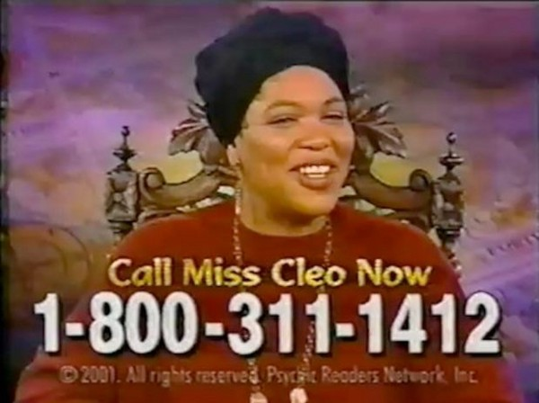
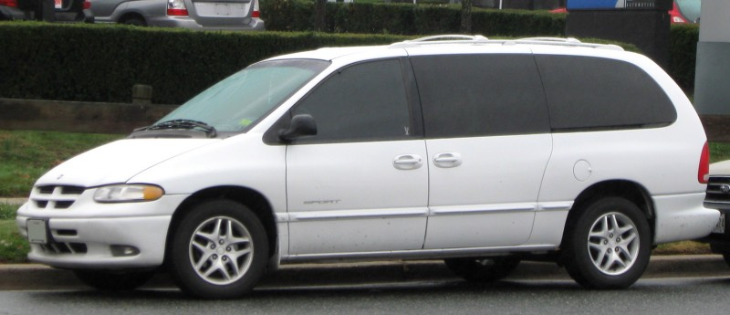
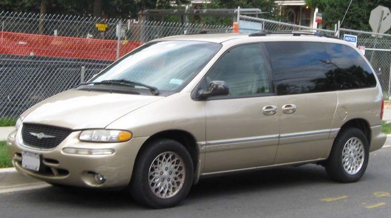

The other week I rented a car for the first time and it reminded me of my former 6th sense. You see, I used to be able to look into the future; I used to be psychic.

My parents, bless their hearts, were very good about taking us on vacations as children. We’d show up to the airport hours early in order to assuage my mother’s perpetual anxiety over missing our flight, and commence with incessant bickering and boredom that drove my parents to the very brink of insanity.

As if our family of 5 wasn’t already pushing it as far as physical and mental composure was concerned, my father would inevitably take a bump if the flight was oversold. My mom’s best friend, a former flight attendant for Delta, aided in the horror by helping my parents purposefully select the overbooked flights in advance.

We flew on vouchers for awhile, this is a story for another time- a tome my sister and I have vowed to publish one day, but I digress back to my psychic abilities.

I’m not sure when my gift started, but it only kicked in in very specific situations, primarily after we had boarded the plane (2 tired parents and 3 shitty kids). After my siblings and I had sufficiently destroyed any remaining sense of calm within a 10 foot radius of our seats, my parents would let me guess the color of our rental car.

At first I thought it was sheer luck. “**WHITE!**” I would say, and lo and behold my dad would pull up in a white Dodge Caravan.

The following trip- a couple bumps and vouchers later- we arrived at our destination and again I gave my psychic insights, “**GOLD!**” Sure enough dad returned from whichever rental car place my mom had a coupon for in a gold Chrystler Town and Country.

#### This went on for years.

My parents were a bit overindulging.

I was batting 1000 and my confidence was at an all time high. En route to some far away exotic land like Orlando, my mother was apologizing to surrounding passengers wounded by flying childrens books while my dad tried to pin my brother and I down so we wouldn’t beat the shit out of each other.

To occupy my psychic mind my mom yelled, “Brad, What color car are we going to get this year?!” I had to put fighting my brother on hold and call on my gift.

I closed my eyes, fingers to my temples and humming (I was a pompous ass at 11 years young). I searched deep, calling on the cosmos to show me the van, our van, waiting for us in Orlando. The vision was foggy so I squinted hard; I needed to show my brother how amazing my gift was — I would will this van into existence.

#### ORANGE

**“ORANGE!**” I yelled.

My parents looked at each other. “Are you sure?” they said in unison.

“I’m sure, I saw it. Our van is _going_ to be _orange_.”

Have you ever seen a orange car, let alone a van? Maybe a Ford Mustang but I was really trying my luck. Can you imagine putting 3 shitty kids in the back of a Mustang?

Hubris, it seems, killed my psychic gift that day. My dad rounded the corner in a black van that day. C’mon dad, really? Black? In Orlando? Are you crazy? Where the hell is the orange van!?

My parents didn’t break the news that they had been choosing their rental car based on my “psychic readings” right then and there. In fact, I think they tried to explain why orange and black were pretty much the same color.

I was too devastated to remember but I imagine my brother and sister let me have it for being a fraud. In that regard, at least I have something in common with Uri Geller.

On the day before our National holiday of Thanksgiving I want to say that I’m thankful for my family.

My parents kept me dreaming and my siblings kept me honest. Without them I wouldn’t be who I am. I can’t wait to eat way too much, bitch about how fat I feel, and laugh about all the memories we’ve shared with them tomorrow.

#### Thanks Mom, Dad, Drew & Kaley

_Originally posted 27 Nov 2013_