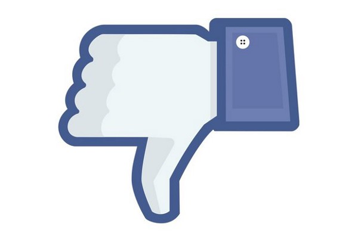

_Two weeks ago, NPR announced that they will be removing comments from their domain, and instead rely on third-party social platforms to engage with their audience._

Stolen from Syracuse.com

This continues a trend of major media creators abandoning on-site discussions and further ceding audience engagement to Facebook (and sometimes Twitter). Much of the discussion is around an issue with moderation and the abysmal rate of interaction. Working at AOL.com, I can attest to the useless vitriol that inhabits so many commenting platforms.

[**Beyond Comments: Finding Better Ways To Connect With You**  
_Enlarge this image At NPR, our success depends on our ability to connect with our listeners and readers. It is the…_www.npr.org](http://www.npr.org/sections/thisisnpr/2016/08/16/490208179/beyond-comments-finding-better-ways-to-connect-with-you "http://www.npr.org/sections/thisisnpr/2016/08/16/490208179/beyond-comments-finding-better-ways-to-connect-with-you")

Today, I’m listening to [_The Pub_ from Current Media](http://current.org/category/thepub/) discuss NPR’s decision:

‘The Pub’ #74: NPR ditches online comments — should you?

This is my first time listening to _The Pub_, and I have to say, I’m a fan. Given that I work in Media, the content may be a bit more relevant for me, but I think the death of on-site commenting is an important trend.

Without going on a long diatribe (as I’m prone to do), it’s my opinion that media entities chased scale, leaving their content presentation too vanilla. True engagement with readers was a secondary goal to securing ad dollars. The end result is that platforms that focused on user engagement outgrew content creators individual domains, and took big ad dollars with them.

The commentary from _The Pub’s_ podcast is thoughtful, specifically around how communities and engagement changes from platform to platform, be it Facebook, Twitter, Reddit, email, etc. Given today’s publishing paradigms, I’d say this podcast definitely deserves a listen. It’s 53 minutes, a great lunchtime listen.

In a parallel world, I imagine media entities building their own, unique platforms to engage their audience appropriately. Certainly, there may still be an opportunity for this, but it seems the era of end-of-article, text-based comments may finally be on their way out.