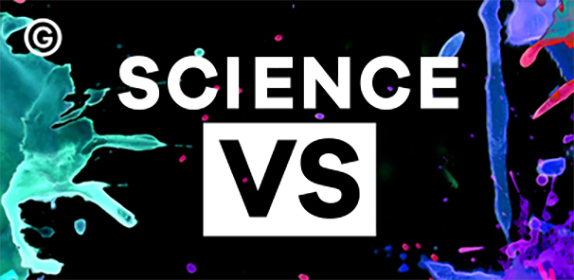

_Gimlet Media’s_ [_Science Vs_](https://gimletmedia.com/show/science-vs/) _is an amazing podcast, full stop. Go listen right now._

W[endy Zuckerman](https://twitter.com/wendyzuk) and her kick-ass team of [Kaitlyn Sawrey](https://twitter.com/KaitSaw) and [Heather Rogers](https://twitter.com/HeatherRogers15) have been flawless in their production of _Science Vs_. This week does not disappoint as they explore [the G-spot](https://gimletmedia.com/episode/6-the-g-spot/). I don’t know if this episode will garner as many downloads as Reply All’s [LSD Microdosing episode](https://gimletmedia.com/episode/44-shine-on-you-crazy-goldman/), but read this description and tell me you aren’t going to listen:

> Maybe you’ve heard about this magic button in the vagina that can give women amazing orgasms. What’s going on there? Is it magic… or is it science? Join us on a hunt for the elusive G-spot. Our guides: Prof. Beverly Whipple, who introduced America to the G-spot in the 1980s, and Prof. Helen O’Connell, a urologist and expert on female sexual anatomy.

Science Vs The G-spot — 38:52 minutes

The first thing I noticed about this show is the exquisite sound editing. I’m no sound engineer, not by a long shot; I mean, hell, my taste in music is unequivocally terrible, but the sound effects and the editing in and out of interviews is noticeably awesome.

Wendy Zuckerman

Speaking of interviews, the next thing you’ll notice about the podcast is how effortless Wendy Zuckerman’s interviews are. She’s got that perfect podcasting voice and, even when prying oil execs about the dangers of fracking, never stumbles.

But, let’s get back to the G-spot — does it even exist!? Well, spoiler alert, we don’t know for certain. Don’t worry, I haven’t actually spoiled the podcast, because this show is all about confronting mystery with science. Admittedly, as a gay man, I’m pretty undereducated when it comes to the female clitoris and g-spot. After about 40 minutes with Wendy, however, I’m infinitely more comfortable with the science.

The other reason I love this show actually has nothing to do with the content (which, again, is fantastic). [Gimlet Media](http://gimletmedia.com) actually bought _Science Vs_ from the [Australian Broadcasting Corporation](http://www.abc.net.au/).

If you haven’t listened to Gimlet’s first show, [StartUp](https://gimletmedia.com/show/startup/), in which the first season is about starting a podcast company, go back and do that. If you’re relocating across the country, or from another one like Australia, [Alex Blumberg](https://medium.com/u/66e153d84bf9) will keep you company.

Gimlet is an incredibly promising podcast startup and this is the first show they brought in from outside. It shows incredible prowess in their ability to identify and acquire great podcasting talent. In somewhat related news, the American ABC has bought the rights to create a TV show based on StartUp. [Film School Rejects](https://medium.com/u/a1de62697a79) has [great coverage of this trend](https://filmschoolrejects.com/on-the-emerging-trend-of-adapting-podcasts-into-tv-shows-and-movies-4c731b13aa38#.fmlmqarhu).

Anyway, check out [_Science Vs_](https://soundcloud.com/science-vs), rate it wherever you listen, and let others know what you think. Happy listening!