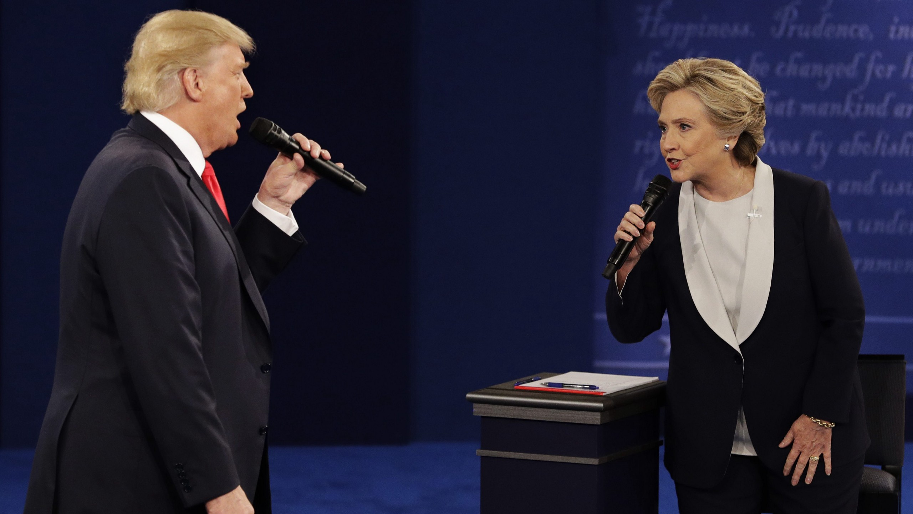
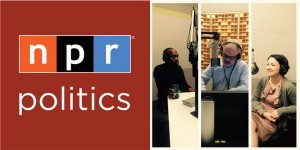
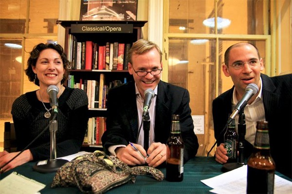
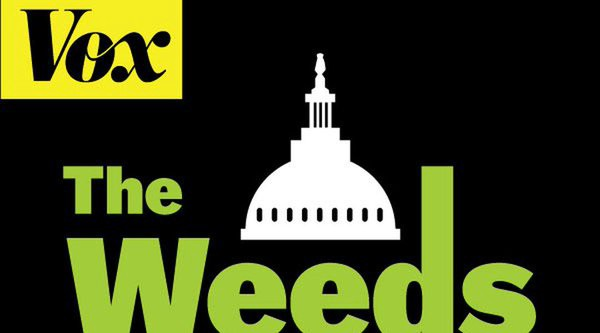
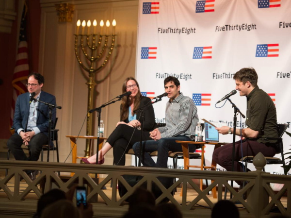
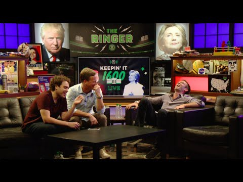

_Get hot takes from some great pundits_

Last night was depressing. As difficult as that “debate” was to watch, voting and education are essential to our democracy. This election cycle, we’re lucky to have some awesome podcasts to keep us up to date and help breakdown some of the more esoteric moments.

Today, I’ve thrown on my headphones and powered through some of these great podcasts and will run you through some of my favorites. Full disclosure, this list agrees for the most part with my political leanings and will not satiate those readers who felt Donald Trump “won” last night’s debate.

#### [NPR Politics](http://www.npr.org/podcasts/510310/npr-politics-podcast)

_NPR_

This is a must listen. [Sam Sanders](https://medium.com/u/6a728fa907e1) conductors this show and does an excellent job of guiding the audience through the slew of events unfolding every week. This team is a group of workhorses and has tried to stay moderate throughout. You’d be doing yourself a disservice by not listening.

One of my biggest desires running up to the party conventions was more frequent podcasts, as weekly just didn’t seem to cut it. I assumed if anyone were to do it, we’d get much shorter episodes; something I’d have been fine with.

Well, the NPR Politics team did me one better. They’re now producing at least two podcasts a week, usually of comparable length. On top of that, in the two weeks leading up to the election, they’ll be recording daily!

[**NPR Politics Podcast**  
_The NPR Politics Podcast is where NPR's political reporters talk to you like they talk to each other. With weekly…_www.npr.org](https://www.npr.org/player/embed/497317075/497348711 "https://www.npr.org/player/embed/497317075/497348711")

#### [Political Gabfest](http://www.slate.com/articles/podcasts/gabfest.html)

_Slate_

This is probably my favorite political podcast week in and week out. I’m a fan of the chemistry and diversity of opinions between the three contributors. Today’s podcast, however, finds them pretty much in lock-step over the debate, but still worth a listen.

[David Plotz](https://medium.com/u/a9534d41d9bf) hosts, with help from [Emily Bazelon](https://twitter.com/emilybazelon) and [John Dickerson](https://medium.com/u/cf81f5da4d24), as they typically cover three topics a week, though recently discussions have been consumed by wild accusations on the campaign trail. I’ve found Emily Bazelon to be one of my favorite voices in podcasting. She’s honest and unwaivering, always with facts behind her.

While you won’t get it in debate coverage, if you listen to some of their other episodes, their third topic is often some semi-obscure research paper (credit due to The Weeds as well for often times bringing esoteric research to light). The three can get in and out of topics with ease, often across a myriad of topics.

#### [The Weeds](http://www.vox.com/the-weeds)

_Vox_

[Ezra Klein](https://medium.com/u/ded33642f914) and [Matt Yglesias](https://medium.com/u/6db5e5e667c7), kings of the blogosphere, are back at it again, this time on the mics, this time with [Sarah Kliff](https://twitter.com/sarahkliff) joining the party. They had the best second debate coverage. If you want to go deep (into the weeds) on the second debate and what’s happening with the Republican party, this is the podcast you should tune into.

_The Weeds_ both succeeds and struggles by being very well informed. Ezra, Matt, and Sarah are some of the wonkiest podcasters out there, befitting of their podcast name. It’s one of those that takes a lot of concentration to get through, but will make you sound smart as hell at the water cooler.

#### [FiveThirtyEight Elections](http://fivethirtyeight.com/tag/elections-podcast/)

_ESPN_

This one is all about polling, people (quick shout out to _The Pollsters_, another great podcast). This show is teeming with personality, with whiz-kid [Harry Enton](https://twitter.com/ForecasterEnten) taking the cake. Debate coverage today had some brief coverage of immediate polls, but Nate and company will remind you they’re not very reliable.

Worth the listen if you have the time, but their coverage at the end of the week will be much more interesting. One moment I really appreciated was Nate Silver’s un-skewing of the Drudge Report’s on-site poll.

[**A Late-Night Podcast To Recap A Very Strange Second Debate**  
_After the second debate between Hillary Clinton and Donald Trump, the FiveThirtyEight Elections podcast crew gathered…_fivethirtyeight.com](http://fivethirtyeight.com/features/a-late-night-podcast-to-recap-a-very-strange-second-debate/ "http://fivethirtyeight.com/features/a-late-night-podcast-to-recap-a-very-strange-second-debate/")

#### [Keepin' It 1600](https://www.google.com/amp/s/theringer.com/amp/p/220924af4c94)

_The Ringer_

I had to throw this one in there. [Jon Favreau](https://medium.com/u/1756c73a8e19) and [Dan Pfeiffer](https://medium.com/u/14c5735369c3), probably two of the least impartial voices in this election, rarely disappoint in their liberal run down of this charade we are calling an election. Sometimes their brevity can be a bit off-putting, but they’re two well-experienced voices giving hot takes from the inside.

Let’s call a spade a spade. If you’re a liberal and like Hillary Clinton, listen to this podcast. It’ll make you feel better when you go to bed at night. Last night was a freeform jam session between Jon Favreau, [Tommy Vietor](https://medium.com/u/a32a3220f7c2), [Jon Lovett](https://twitter.com/jonlovett), and [Olivia Nuzzi](https://twitter.com/Olivianuzzi) nailing Democrat high points from last night.

Don’t turn to Jon and Dan for some impartial punditry, but if you need somebody to hear somebody saying the things running through your head, tune in bi-weekly.

That’s probably more audio than you want to consume in a day, but I’d highly recommend listening to one of the shows above. I know I’m missing a lot of smaller podcasts and just ran out of time myself today, but if there’s any other political podcasts you enjoy, please leave them in the comments.

> Happy Listening!

At the time of writing, the NYTimes [_The Run-Up_](http://www.nytimes.com/podcasts/run-up), BuzzFeed’s [_No One Knows Anything_](https://www.acast.com/nooneknows), and [_The Pollsters_](http://www.thepollsters.com/) with Margie Omero and Kristen Soltis Anderson had not published debate coverage but are all awesome podcasts.