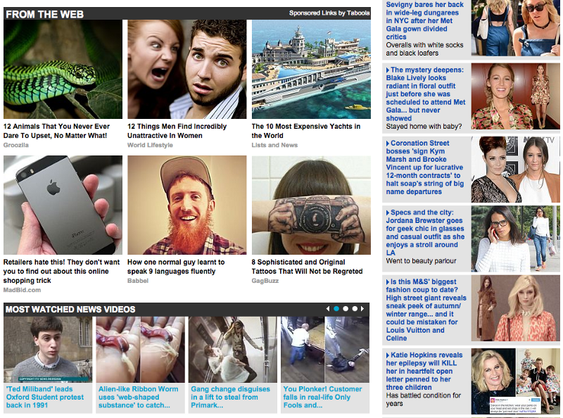
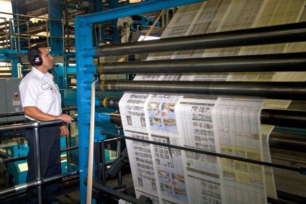
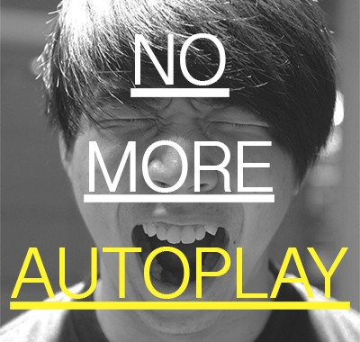
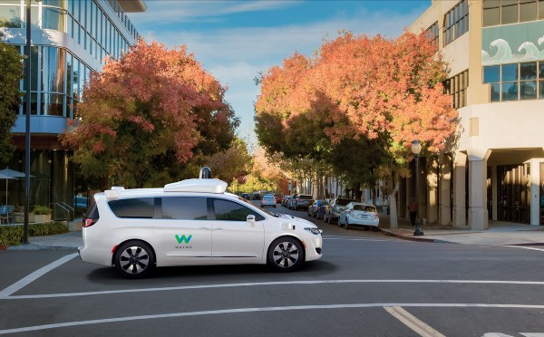
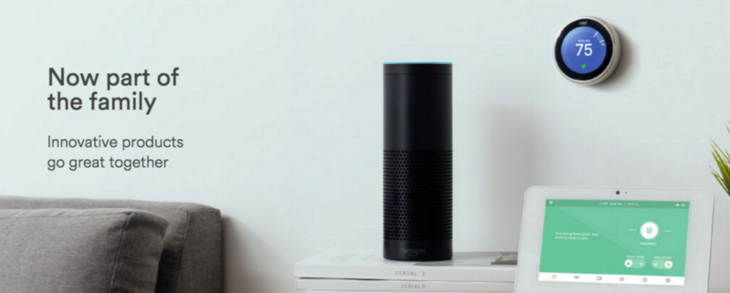

Last week, Evan Williams wrote about building a new business model for publishing, and the human cost of changing course. Undoubtedly, Medium has loads of cash and talent left that will continually delight us. However, I have persisting, serious doubts in a text-based media world.

Listen along as I read my words! Pardon the awful sound quality.

Would you click on any of these?

The problems inherent to the digital media space are obvious: click-bait headlines, auto-play video, poor ad experiences, obnoxious content recommendation widgets, the list goes on and on.

It’s worthwhile considering the technological conditions that got us here. The printing press and the internal combustion engine made the creation and distribution of text-based content cheap and easy, and classified ads made monetization simple.

cyprusscene.com

Under the protection of geographic monopolies, editorial teams were born that focused heavily on this singular medium, while advertising teams specialized on measurable experiences. That was, of course, all before the internet. I don’t think anyone has written about this better than [Ben Thompson](https://twitter.com/benthompson), and I’d highly recommend subscribing to [Stratechery.com](http://stratechery.com).

Extrapolate to today, as I lie here scrolling through listicles — which are essentially free to distribute everywhere— plastered with “more effective” retargeted ads for mattresses. It’s easy to feel like our media model is broken considering I’m laying on the new mattress I bought last week.

Medium set out to make writing and storytelling on the internet more beautiful. **They did it!**

Seriously, this blog was so easy to publish, and it looks way better than any CSS I could cobble together, or used a myriad of plugins to format my text. Few digital reading experiences can compare to the wonderment of Medium, and certainly not in the long tail.

The ultimate problem with text though is that there’s no perceivable value. Whereas users have shown a willingness to pay for Netflix, we’ve seen the [rate of ad-blocking rise sharply with no broad success of subscriptions or microtransactions for digital text](http://www.cjr.org/analysis/reuters_digital_news_report.php). Worse for Medium, the cost of CMSes has been driven almost to zero, so a SaaS model would also be one hell of a slog to profitability.

#### No, Medium’s Achilles Heel is in its medium.

In a protracted conversation two nights ago about business models for Medium and other publishers, I found myself repeating this mantra: that digital news pigeon-holed ourselves into text as our default medium.

We built our CMSes and monetization models focused on text-correlated evidence and assumptions (i.e. clicks and page views). And, as consumption has changed, the chinks in our collective armor have become blatantly obvious, poorly covered with duct tape sold by Taboola et al.

ampercent.com

To salvage our broken businesses model, we’ve turned to another medium — _Video_. No matter what consumer video consumption patterns are, nor the conditions around the TV business’ existence, and no matter that consumers aren’t asking for a deluge of mobile video on publisher sites, we soldier on.

If brands are spending copious amounts of dollars on traditional TV, then maybe we can save our sinking ships by forcing more video down our revolting consumers’ throats in an effort to capture those TV ad dollars.

What the media industry needs more than anything is a fresh look at how content should be delivered to users. Then and only then will we be able to determine what systems we need to be built. Regrettably for Medium, that’s not another text-based CMS.

Waymo.com

Collectively, industries are being upended by a massive explosion of sensors, data, and machine learning. You don’t have to wait but 10 minutes to hear something new about [self-driving cars](https://medium.com/waymo/say-hello-to-waymo-whats-next-for-google-s-self-driving-car-project-b854578b24ee#.kasw4gdw0) these days. The most successful players in other industries are embracing change and exploring new business models based on entirely new paradigms.

Strolling around CES last week, it would’ve been impossible to miss that Amazon’s voice assistant, Alexa, was the most dominant force. We’re moving quickly towards a voice-driven world, and yet our failures of monetizing text-based content are being filled by video nobody is really asking for or watching.

Amazon.com

[Ev Williams](https://medium.com/u/268314bb7e7e) and all the other [Medium Staff](https://medium.com/u/a32c340ea342), we need a CMS that helps us tell beautiful stories across a multitude of platforms in a multitude of ways. If we’re radically going to redefine the way we monetize content creation, then we need to radically redefine consumption patterns.

Dominant media companies of the future will fully embrace [transmedia storytelling](https://en.wikipedia.org/wiki/Transmedia_storytelling) and greet their audiences on their audiences’ turf. We will embrace the insane amount of data available by the explosion of sensors, whether that’s simple signals like geolocation, temperature, and time of day or more complex signals like heart rate, voice inflection, or social sentiment analysis.

Uncertainties around monetization persist, but without fulfilling the needs and desires of our readers, listeners, and viewers we’ll continual to build our media businesses on quicksand.

[**Renewing Medium’s focus**  
_We’ve decided to make some major changes at Medium._blog.medium.com](https://blog.medium.com/renewing-mediums-focus-98f374a960be "https://blog.medium.com/renewing-mediums-focus-98f374a960be")