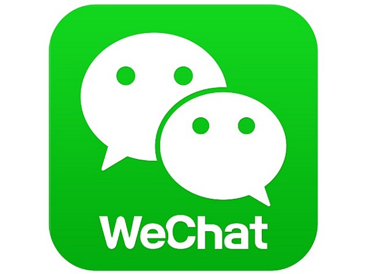
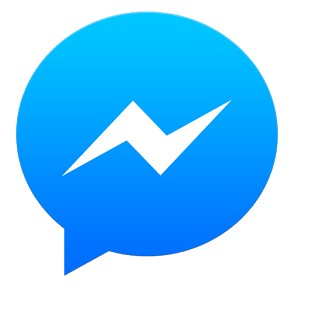

_The renaissance of chat seems to be sputtering_

Stop me if you’ve heard this before:

> Chatbots are taking over the world!

I could insert graphs showing messenger applications overtaking social media applications, graphs showing the death of apps, or even better graphs of the meteoric rise of FB Messenger Bots created over the past few months. And yet, while text-based bots are experiencing a rebirth from their [SmarterChild](https://en.wikipedia.org/wiki/SmarterChild) days, we should start exploring why text-based UX has made a resurgence.

Looking East, WeChat is likely the most important player in this recent paradigm shift. The Tencent-owned social app looks much more a WhatsApp than Facebook competitor, but make no mistake, WeChat is the identity hub of China. In 2012 (using stats pulled from a quick Google search), the US averaged 3 computers per home. Compared to China, where only about 90% of homes owned a computer, it’s easier to understand why a mobile-first identity service came to dominate email-based networks.

Additionally, the Chinese mobile OS ecosystem was extremely fragmented: forked versions of Android, a multitude of proprietary App Stores, piracy galore. WeChat, born in a phone-centric world, built a messaging app that worked across all these platforms and delivered messages essentially for free. In doing so, they amassed of hundreds of millions of users and owned their identity.

Developers and brands alike saw a simplified opportunity to reach the Chinese mobile market without having to build and test across thousands of devices, and WeChat gave them a text-based platform to do so. Thus, the modern Chatbot was born behind the Great Firewall.

10 years ago, the iPhone birthed the mobile era. Suddenly, developers had a “cost-effective”, scalable means of reaching these new users — the App Store — but with it came restrictions. Given their revenue share model, Apple has always been incentivized to force developers to leverage their store.

In the decade since, developer opportunities have dwindled — crowded app stores, onerous reviews, inflexible monetization opportunities, and growing development costs — without much aid from platform owners. In Asia, messaging apps like LINE, Kakao Talk, and the juggernaut WeChat were growing furiously, as were their OS-agnostic messaging apps. With Facebook’s blockbuster purchase of WhatsApp, it became clear: Messaging is the platform of the future.

In response, Apple took a LINE-like approach with iMessage mini-apps, while Google opted to rely on an AI assistant to surface and manage integrations with businesses, but neither runs cross-platform. With apps for iOS and Android, Facebook Messenger flanked the App Stores and fully embraced text-driven bots. Their upcoming Bot Store, akin to WeChat’s platform model, is OS agnostic and gives developers a new opportunity to rise above the noise.

In many ways, the Messaging Wars are a rebirth of the Browser Wars. Microsoft’s reliance on desktop software impeded it’s embrace of the web, while Google simply built on top of Microsoft and Apple, unshackled from legacy tech debt. Messaging bots have significant draw backs to Native apps — they lack low level APIs like geolocation — but are a healthy and necessary experiment at the notification layer.

Half a year after Facebook’s WhatsApp acquisition ignited the Messaging Wars, Amazon through a new wrench into the mix with the announcement of the Echo. While voice interaction is in it’s early days, one can’t help but notice [Alexa was this year’s CES star](https://www.engadget.com/2017/01/12/amazon-alexa-2017/).

In many ways, voice-based apps share similar restrictions with Chatbots. While we’ve started to flesh out initial user engagement strategies, we still rely on older platforms to fully complete an action. I love my morning flash-briefing from NPR and my clever weather greeting from Poncho on Facebook Messenger, but I cannot casually further explore strictly within those platforms.

We’re seeing an abstraction away from robust, visual interfaces, and moving towards more bare bones, language-based interfaces. In this way, voice and chat have both very similar use cases and shortcomings. Just as Apple corralled developers to building Native apps, new platform owners will try and push their decided paradigms upon us.

To date, Chatbots have failed to wow, but they aren’t going away; just look to WeChat’s empire. However, as we build for the future, it’s worth considering the current issues faced by Native app developers, and whether we can design around them in chat and voice. The ultimate challenge is to build platform agnostic experiences and let our users choose their platform based on environmental factors.

_It’s been brought to my attention that Bloomberg did a run down of WeChat’s platform yesterday!_

[**WeChat's App Revolution**  
_The biggest long-term threat to the iPhone isn't Android, Samsung Electronics Co. or China's bevy of cheap phone makers…_www.bloomberg.com](https://www.bloomberg.com/view/articles/2017-01-19/wechat-s-app-revolution "https://www.bloomberg.com/view/articles/2017-01-19/wechat-s-app-revolution")

_If you liked this, I’d be grateful if you hit that little heart at the bottom!_