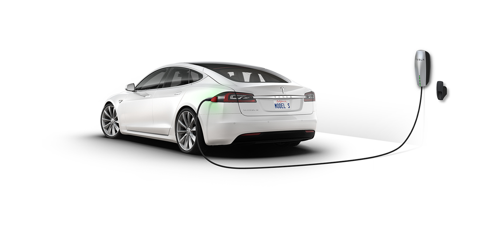
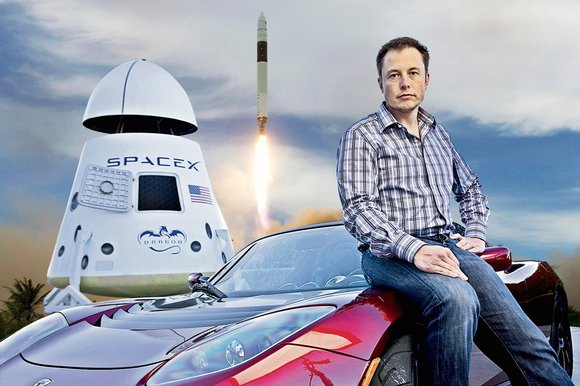

_The growth of edge computing favors this automotive upstart_

Twitter’s _Fabric_ sold to Google, and yesterday Facebook’s _Parse_ shut down. The social upstarts that sought to dethrone computing superpowers by democratizing development tools have largely failed. No, it’s a bookstore that managed to assail the previous moats built by Oracle, Microsoft, and Google out of millions of servers.

It seems the dominant tech platform of our time is turning over at an ever increasing pace. And yet, during their reign, it seems the current champion will never be upset. Even in writing that, and knowing I’m going to end this by saying Amazon will be dethroned, it still feels nearly impossible. Yes, first and foremost, I am saying Amazon is the most powerful tech company; AWS brought cloud computing to the mainstream and continues to lead the pack.

Amazon’s gradual evolution from book seller to providing the modular infrastructure for almost any business has endowed them with diverse and healthy revenue streams, their juggernaut being AWS. Herein lies Amazon’s Achilles heel. The same way Google is dependent on visual web searches to generate revenue, Amazon is dependent on being the **_centralized_** operations backbone of internet businesses to generate revenue.

However, the next wave of our computing revolution won’t happen in centralized clusters, but will be driven by [edge computing](https://en.wikipedia.org/wiki/Edge_computing):

> **Edge computing** is pushing the frontier of **computing** applications, data, and services away from centralized nodes to the logical extremes of a network. It enables analytics and knowledge generation to occur at the source of the data.

A month ago, I saw [Peter Levin](http://a16z.com/author/peter-levine/)’s presentation about [The End of Cloud Computing](http://a16z.com/2016/12/16/the-end-of-cloud-computing/). At 25 minutes long, and definitely worth the time.

a16z.com

The economies of scale inherent in data centers built by Google, Microsoft, Amazon, et al. makes profit-seeking nearly impossible in edge computing. Thus, anybody that wants to build the edge computing application layer would need a massive network of interconnected supercomputers. While we’ve seen an explosion of connected devices, many of these lack any serious computing power. Which brings me to Tesla.

The _Model S_ is both a supercomputer and power plant. Tesla builds mobile data centers and the applications that run on top of them, from battery management to self-driving software. Because of the immense number of realtime calculations these vehicles must make, a Tesla cannot rely on centralized cloud computing; the network is too slow. They’re been built to operate off-network and accomplish all necessary computing onboard.

At the moment, Teslas communicate back to the mothership using standard cellular protocols to exchange data and download software updates. Make no mistake though, Elon Musk will forego cellular connections and, instead, build a mesh network between vehicles. As you pass another Tesla, it will safely and securely exchange information, potentially sharing their onboard computing power to test a new self-driving algorithm.

The development of a mesh network between connected devices and a common application development language will be the first cracks in Amazon’s defense. Initially, this computing framework will be vastly underpowered, but as the number of connected devices swell, so will the threat to centralized computing. At this point, it’s silly to argue if Elon Musk has broad ambitions like becoming the most powerful tech company in the world; of course he does!

The kind of computational power that will be necessary to process from an explosion of sensors in our cars, our ovens, maybe even our t-shirts will dwarf existing capabilities. If Tesla were to make the enormous amount of mobile computing power available to other machine learning algorithms while the car was “dormant”, they could be the catalyst to a compelling alternative to centralized computing.

With the hiring of Apple vets [Chris Lattner](https://www.tesla.com/blog/welcome-chris-lattner) and [Jim Keller](https://electrek.co/2016/01/28/tesla-jim-keller-apple-processor-architect-2/) to lead Tesla’s Autopilot Software and Hardware respectively, I can’t help but imagine they intend to build the world’s best platform for distributed applications (of which Autopilot is but one implementation). In the coming seismic shift in computing power, the only doubt I have is whether Tesla will pursue a product or platform strategy.

Elon Musk hasn’t shied away from capitally intensive products, in fact he’s pursued maybe the three most expensive industries: automobiles, energy utilities, and space travel. In his attempt to reinvent these industries, his companies have built wholly integrated products aimed at premium customers. Regardless of what Elon Musk says, the existing Tesla product lineup favors consumers with extensive discretionary income, yet each new product launch is aimed at a broader and broader market.

The dedication to integrated solutions certainly makes Elon Musk’s Tesla look like Apple. However, Apple never pursued a downmarket strategy. Tesla’s battery and solar panel innovations, as well as the Model 3, shows they are very much interested in expanding their market penetration. After reshaping existing industries, Tesla may push to be a utility provider, seeking much smaller margins across a much, much larger customer base.

Steve Jobs built the most valuable company in the world on the back of extremely healthy _iPhone_ profit margins. Jeff Bezos has demonstrated the awesome power of investing in the longterm and pushing margins to the lowest limit to deter competition. Elon Musk’s unique ability to build critically acclaimed consumer products while investing in an unforeseen future makes him a potentially dangerous combination of these two.

It’s impossible to say if Musk and Tesla will shift their efforts from high to low margins and become the de facto edge computing infrastructure provider. Tesla’s [2014 broad patent open sourcing](https://www.tesla.com/blog/all-our-patent-are-belong-you), the building of their [Gigafactory](https://www.tesla.com/gigafactory), and Musk’s personal obsession with artificial intelligence and founding of [OpenAI](https://openai.com/about/) certainly signals their broader ambitions. Interestingly, access to the Supercharger network feels like a Prime benefit.

I predict we’ll see Tesla pivot to providing distributed computing components and batteries to a host of automobile manufacturers, akin to [Google’s Waymo](https://waymo.com/) strategy, but the automobile is just one landing point. Sensors, batteries, and shared computational power will be essential in all future appliances. I imagine access to the collective computing power of Tesla’s network will establish developer lock in.

I’m no Nostradamus, but if history is any indicator, the next tech giant already exists. Maybe it’s Tesla, maybe it’s [just a few nerds](https://www.silklabs.com/) chipping away at the business models of today. One thing is for certain, edge computing will greatly disrupt our current paradigms.

Care to get really esoteric? Try and surmise what our next computing evolution will be beyond edge computing. For now, I’ll save that for another Tuesday morning.