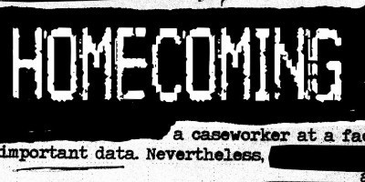

Welcome to Week 6. Given the news has been a bit hard on all of us for some time, we tried to pick out some more uplifting topics. We also decided to start experimenting with a [Facebook group](https://www.facebook.com/groups/inqueue). It’s open and we’d love to invite all of you to join. We’ll start up some discussions this weekend.

This week, we open with a discussion about the Red Cross and charitable giving in general; _Mic_ closes the topic on a hopeful note. Then, because space is awesome, we talk recent physics discoveries and how much more space there suddenly is. In the entertainment world, we decided that some bad-ass women deserve highlighting. Finally, podcasts are sneaking into your living room TV, whether you noticed or not, so keep an eye and ear open.

Have you liked or subscribed to any of the podcasts we’ve recommended? Tell us about it! If you haven’t, get to liking. The medium depends on us showing our love and helping these shows grow. In addition to joining our Facebook group, please follow us on [Twitter](https://twitter.com/inqueuepodcasts) and like our [Facebook page](https://www.facebook.com/inqueuepodcasts/).

### Happy Listening!

### The Red Cross and Charity

Natural disasters continued this week with wildfires raging across Northern California. It also came to my attention that [the Red Cross has been relatively absent](https://www.propublica.org/article/texas-official-after-harvey-the-red-cross-was-not-there) in many post-hurricane relief efforts. Over the years, we’ve given to the Red Cross, so it was interesting to learn they may not be the best charity to give to.

We wanted to better understand the Red Cross and charity this week. _Stuff You Missed In History Class_ covered the founding, Brian Lehrer recently covered controversy around the Red Cross, and finally, _Mic_ gave us a look at how to donate to charitable causes.

#### Stuff You Missed In History Class

### [Henry Dunant, Founder Of The Red Cross](http://www.missedinhistory.com/podcasts/henry-dunant-founder-of-the-red-cross.htm)

Stuff Media is a great place to start if you’re looking for the history behind a topic. After witnessing the brutality of war, Durant decided to found the Red Cross, a neutral organization to provide care to wounded soldiers. He became the first person to receive the Nobel Peace Prize. _\[32:12\]_

#### The Brian Lehrer Show

### [Disaster Relief Efforts To Effectively Help A Community](http://www.wnyc.org/story/red-cross-and-its-detractors/)

Brian Lehrer’s show is always a very measured look at what’s happening in the world. As hurricanes tore across the Atlantic and controversy over the use of Red Cross donations resurfaced, he invited Stacy Palmer, editor of the [_Chronicle of Philanthropy_](https://www.philanthropy.com/page/Editorial-Staff-Stacy-Palmer/599), to talk about disaster relief donations. _\[41:35\]_

#### Mic — Payoff

### [Here’s How To Make Sure Your Donations Count](https://mic.com/articles/184561/charity-navigator-explains-how-to-avoid-scams-vet-organizations-and-make-sure-your-donations-count#.oUmsifQUS)

_Mic_, typically viewed as a millennial-focused publication, read the same _Pro Publica_ report abut the Red Cross we did, and decided to cover it in their finance focused podcast. First, they debate the efficacy and morality of charity, and are then joined by Michael Thatcher, CEO of Charity Navigator. _\[31:35\]_

### The Universe’s Missing Matter

This week the Nobel Prize in Physics was awarded to the team that first measured gravitational waves and additionally two separate teams potentially discovered [half of the universe’s missing matter](https://www.newscientist.com/article/2149742-half-the-universes-missing-matter-has-just-been-finally-found/). As our understanding of the universe expands, it’s worth digging up some podcasts and learning more.

We found three loosely related podcasts about space. The first, from _Science Fridays_, is a brief look at dark matter, then a look at gravitational waves on a show we didn’t expect to love, and, finally, we couldn’t help but go back to Neil deGrasse Tyson to hear about what actually makes up the universe.

#### Science Fridays

### [T](http://www.wnyc.org/story/on-the-media-2016-06-24/)[he Hunt For Dark Matter](https://www.sciencefriday.com/segments/the-hunt-for-dark-matter/)

Start your science listening with a fun, quick discussion about the Large Underground Xenon (LUX) experiment located a mile underground in Lead, South Dakota. This is where neutrinos were first discovered, and there’s hope that they’ll be able to measure dark matter on earth down here as well. _\[11:07\]_

#### Linear Digressions

### [Gravitational Waves](http://lineardigressions.com/episodes/2016/2/29/gravitational-waves)

So, we were pretty unsure about this show before we listened because it’s self-described as being about machine learning and data science. Turns out, this episode is super approachable and a pretty fun listen as the hosts discuss what gravitational waves are and how they were discovered. _\[20:26\]_

#### StarTalk Radio

### [Cosmic Queries: Galactic Gumbo](https://www.startalkradio.net/show/cosmic-queries-galactic-gumbo/)

Anytime there’s a space topic, you best believe we’ll go looking to see what Neil deGrasse Tyson has to say about it. Six months ago, he did an hour long Q&A about all things space before getting into some hardcore physics chat. We’re total fan-persons of deGrasse Tyson, so we’re biased, but this is a fun listen. _\[55:10\]_

### Women Changing Entertainment

[Harvey Weinstein is a pretty big piece of shit](https://www.nytimes.com/2017/10/09/opinion/harvey-weinstein-lena-dunham-silence-.html?_r=0) and his legacy in Hollywood will be challenging to unravel. Thankfully, we’re seeing the emergence of new platforms empowering women. We found powerful women at Netflix, YouTube, and HBO to highlight, and they’re all some real bosses.

Shonda Rhimes — queen of entertainment — when asked what she can’t do quickly and confidently responds, “I’m not scared of anything”, Susan Wojcicki talks about rising to become the most powerful woman at Google, and — in maybe one of my favorite interviews I’ve listened to — Sheila Nevins doesn’t hold anything back when talking to Katie Couric about her storied career.

#### Recode Decode

### [Why Shonda Rhimes Left ABC For Netflix](https://www.recode.net/2017/10/9/16444674/shonda-rhimes-netflix-abc-shondaland-scandal-kara-swisher-recode-decode-podcast)

Shonda Rhimes’ voice is decidedly forceful from Kara Swisher’s first question. It’s no doubt she’s risen to the top of the entertainment world food chain. We found her musings around [Shondaland](http://www.shondaland.com/) most interesting and powerful. Tune in to hear what the future of entertainment sounds like. _\[43:04\]_

#### Marketplace

### [The CEO Of YouTube On Her ‘Lightbulb Moment’ About Video](https://www.marketplace.org/2016/10/21/business/corner-office-marketplace/youtube-ceo-her-lightbulb-moment-video-would-be-huge)

Google was born in Susan Wojcicki’s garage and she now runs what is likely over a $100 billion business in YouTube. Under her leadership the site has gone from cat video portal to entertainment juggernaut, quietly amassing relationships that will allow if to become the new cable. _\[40:02\]_

#### Katie Couric

### [Sheila Nevins: TV Trailblazer](http://katiecouric.com/sheila-nevins-tv-trailblazer/)

We hadn’t heard of Sheila Nevins, the president of HBO Documentary Films, before this week, but wow were we missing out. She is as honest as we’ve ever heard, and, when you’ve produced over 1000 films, you have nothing to apologize for. We can’t wait to check out her [new book](https://www.amazon.com/Dont-Look-Other-Fairy-Tales/dp/1250111307). _\[49:04\]_

### Podcasts Headed for TV

In our grab bag topic (yes, we have topics for all these sections), we thought we’d take a look at the fiction genre in podcasts and the emerging trend of [TV networks licensing these shows](https://filmschoolrejects.com/on-the-emerging-trend-of-adapting-podcasts-into-tv-shows-and-movies-4c731b13aa38/). As podcasts grow into the mainstream, this may become one of the most important funding mechanisms.

Amazon ordered two of these shows — _Homecoming_ and _Lore_ — while USA has ordered the serialized CB radio drama _Alice Isn’t Dead_. Each show represents a different type of narrative: _Homecoming_ a complete story, _Lore_ completely unrelated eerie stories, and _Alice Isn’t Dead_ an open-ended mystery.

#### Gimlet Media

### [Homecoming](https://gimletmedia.com/homecoming/)

When _Homecoming_ debuted with Gimlet, it was anchored with a star-studded cast including Catherine Keener, Oscar Isaac, and David Schwimmer. Now the drama has been picked up by Amazon for two seasons with Julia Roberts starring and Sam Esmail directing. Add this to Gimlet’s growing list of shows bought by TV networks.

#### Night Vale Presents

### [Alice Isn’t Dead](http://www.nightvalepresents.com/aliceisntdead/)

_Welcome to Night Vale_ follow-up _Alice Isn’t Dead_ is a drama told over CB radios as a trucker searches for her missing wife. The thriller is being made into both a book and a TV show, a concept I imagine will be repeated. USA Networks picked up the show and Harper Perrennial will publish the book.

#### Lore

### [Lore](http://www.lorepodcast.com/)

Lore actually launches on Amazon today! Aaron Mahnke started _Lore_ to talk about the stories he loved researching. From the beginning, his editing was great and Mahnke’s eerie pace matches his material. First came a book series, and now [it’s made its way to TV](https://www.theverge.com/2017/10/13/16465922/lore-tv-series-review-amazon-prime-aaron-mahnke-campbell-scott-glen-morgan). I don’t immediately see how it could become a movie, but we wouldn’t be shocked, or would we?

### We want to hear from you!

How did you like our suggestions? Which podcast was best? Did you start following any of the shows? [Tell us](mailto:birdandcandy@gmail.com?subject=Newsletter%20Suggestion)!

Don’t forget to tell every person you make eye contact with that they should also [sign up for this newsletter](http://eepurl.com/c4m7yT). Also, check out our [archive](http://us15.campaign-archive2.com/home/?u=539f7a4474212160f81ea7b19&id=9eb1e1ec64) if you’ve missed past issues.