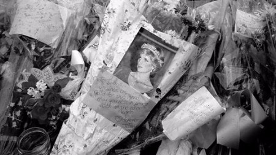
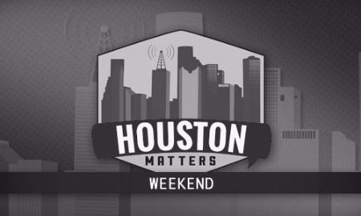
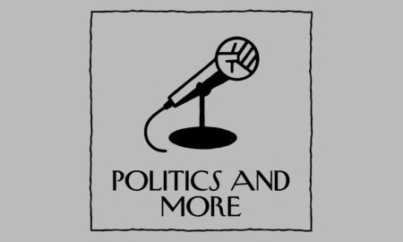

We’re scouring the interwebs for podcasts tangential to the news to give you more color about what’s happening in this crazy world of ours.

This week, we take a look back at Princess Diana, Hurricane Katrina, and Watergate. We also threw in a fun podcast from one of our absolutely favorite shows, Reply All. Make sure to like, rate, and share these podcasts as it really helps the producers.

If you’re able, please take a moment and donate to Direct Relief, a charity to “improve the health and lives of people affected by poverty or emergency situations by mobilizing and providing essential medical resources needed for their care”.

> [**Donate To Direct Relief**](https://secure.directrelief.org/site/Donation2;jsessionid=00000000.app267b?df_id=2105&mfc_pref=T&2105.donation=form1&NONCE_TOKEN=D796B10B47B5CE9BDFCE3399D3DCCDED "Donate To Direct Relief")

#### BBC Radio 4 — Woman’s Hour

### [Princess Diana and her impact on black women](http://www.bbc.co.uk/programmes/b09295l8)

_46:38_

20 years ago Princess Diana passed away in a tragic car accident. BBC’s_Woman’s Hour_ takes a look back at the lasting impact she had on normalizing royalty for women who traditionally felt isolated from the royal pageantry.

#### Houston Public Media

### [Remembering Katrina](https://www.houstonpublicmedia.org/articles/shows/houston-matters/2015/08/28/213116/remembering-katrina-fridays-show-august-28-2015/)

_50:43_

2 years ago, Houston Public Media took a look back at the most devastating natural disaster in US history: Hurricane Katrina. Last week, Harvey drowned Houston for days on end, likely surpassing Katrina. This is a sobering look at how Houston viewed Katrina and the lasting effect of natural disasters.

#### New Yorker Radio Hour

### [The Lessons of Watergate](https://www.newyorker.com/podcast/political-scene/the-lessons-of-watergate)

_21:40_

Donald Trump Jr. testified in a closed door committee about his summer meetings with Russian lawyers in the latest episode of Russiagate. These days, everything seems to be named Something-gate. Last spring, _The New Yorker_ took us back to Watergate and reminds us how this silly naming convention started.

#### Reply All

### [The Case of the Phantom Caller](https://gimletmedia.com/episode/104-case-phantom-caller/)

_35:09_

_Reply All_ is one of our favorite podcasts. Hosts Alex and PJ investigate all things internet and this week does not disappoint. What’s going on when a woman keeps getting mysterious phone calls? A month long investigation alerts the FBI to a bold but mysterious phone phreak.

### We want to hear from you!

How did you like our suggestions? Which podcast was best? Did you start following any of the shows? Tell us!