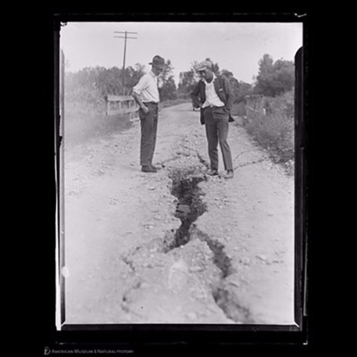
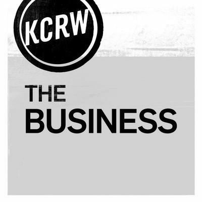
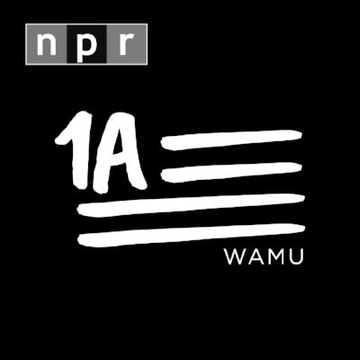

Bird & Candy here, back after searching the annals to discover interesting audio for your weekend. This week we focused on the humanitarian crisis in Myanmar, geological disasters in Mexico, diversity at the Emmys, and the ongoing consumer credit fiasco that is Equifax.

We pulled together voices from across the world, from New Zealand (twice) to Wall Street to the UK, relying heavily on public media. It’s a reminder of how vital non-profit driven journalism is to recording and understanding our collective history.

As always, if you like these shows _follow them!_ Also, rate, review, and share because it’s crucial for a podcast’s success. Finally, when you’re binging on podcasts this weekend, don’t forget to tell your friends where you got your recommendations from: [Bird & Candy](http://eepurl.com/c4m7yT).

### Exodus in Myanmar

Aung San Suu Kyi was considered the Nelson Mandela of Myanmar and [received the Nobel Peace Prize](https://www.theatlantic.com/international/archive/2017/09/aung-san-suu-kyi-nobel-prize/540453/) in 1991 after her non-violent struggle for democracy in 1988. Recently media attention has swirled around Myanmar as [400,000 Rohingya refugees fled the country](https://www.vox.com/world/2017/9/18/16312054/rohingya-muslims-myanmar-refugees-violence) due to ethnic cleansing and Aung San Suu Kyi’s shocking moral absence.

Who are the Rohingya, what the hell is happening at the hands of the Myanmar military, and — finally — how did the then-Burmese Uprising in 1988 earn Aung San Suu Kyi the Nobel Peace Prize?

#### Radio New Zealand: Insight

### [Rohingya: Exile in the Rakhine](http://www.radionz.co.nz/national/programmes/insight/audio/201795215/insight-the-rohingya-injustice-ignored-in-myanmar)

Candy discovered Radio New Zealand for this podcast. It’s almost 18 months old and highlights the ongoing atrocities the Rohingya people face in Myanmar. Interestingly, it posits that Aung Sun Suu Kyi might have a positive influence on their treatment. _\[28:18\]_

#### BBC The Documentary

### [Freedom and Fear in Myanmar](http://www.bbc.co.uk/programmes/p04xpsr7)

From only six months ago, this BBC documentary provides another look at the Rohingya’s situation one year after the Radio New Zealand story above. In the lightest terms possible, it’s disappointing. _\[26:56\]_

#### NPR Radio Diaries

### [A Look Back On A 1988 Uprising](http://www.npr.org/2013/08/08/209919791/as-myanmar-opens-up-a-look-back-on-a-1988-uprising)

In 1988, students rose up against the Burmese dictatorship and demanded economic and social freedoms. NPR investigates the revolution and how Aung Sun Suu Kyi emerged as their leader. _\[12:55\]_

### Mexico’s Earthquakes

Over the last few weeks, it’s been impossible to turn on the news and not see the devastation of natural disasters; in fact, two weeks in a row, [Mexico has been rocked by earthquakes](https://www.scientificamerican.com/article/why-the-mexico-city-earthquake-shook-up-disaster-predictions/). It’s important to not only know what happened, but also why it happened.

We’ve found an update on the crisis in Mexico, a very technical look at why earthquakes occur, and how scientists try and predict seismic activity.

#### PRI’s The World

### [Desperate Search for Survivors in Mexico](https://www.pri.org/stories/2017-09-20/desperate-search-survivors-after-powerful-earthquake-mexico)

A 7.1 magnitude quake was centered about 100 miles from Mexico City, but caused about 45 buildings in the capital to collapse. Rescue teams are frantically working to save people trapped by rubble. PRI provides an update. _\[3:16\]_

#### Science at the AMNH

### [The Global Surge in Earthquakes](https://www.amnh.org/explore/news-blogs/podcasts/the-global-surge-of-earthquakes)

The American Museum of Natural History has converted some of their guest lectures into podcasts. In this one, Dr. Thorne Lay examines why earthquakes may be getting stronger and more frequent. _\[1:19:04\]_

#### Radio New Zealand: This Way Up

### [How Seismic Sensing Works](http://www.radionz.co.nz/national/programmes/thiswayup/audio/201825308/earthquake-alert!-how-seismic-sensing-works)

How does the movement of the earth’s crust get recorded and then broadcast as an alert to your phone within seconds? For the second time in a week, we found a great explainer from Radio New Zealand. _\[15:35\]_

### New Voices at the Emmys

In times of American uncertainty, Emmy voters awarded shows that challenged norms and gave forewarning to potential futures to come. [Donald Trump’s focus](https://twitter.com/realDonaldTrump/status/910332992756834304)on ratings misses the bigger story of this year’s Emmy awards: TV is changing, and it represents a much more diverse set of voices than _The Apprentice_.

Riz Ahmed became the [first South Asian man to win an Emmy acting award](https://www.washingtonpost.com/news/morning-mix/wp/2017/09/18/riz-ahmed-makes-history-as-the-first-south-asian-man-to-win-an-emmy-acting-award/?utm_term=.620ec08213d7)while Donald Glover became the [first black man to win the best director of a comedy award](http://www.huffingtonpost.com/entry/donald-glover-emmy_us_59bf1fb7e4b0edff971d1b1d) for _Atlanta._ Glover then thanked Trump in a way only Glover could. Get a recap of the Emmys, a look at how FX Networks president John Landgraf sees the world, and dive deeper into the FX show _Atlanta_.

#### The Watch

### [Emmy Winners (and Losers)](https://www.theringer.com/2017/9/18/16330308/emmy-winners-and-losers)

That’s two weeks in a row we’ve picked out _The Watch_, mostly because it’s such a staple of my entertainment diet. Andy Greenwald and friends breakdown last weekend’s award show. _\[47:15\]_

#### KCRW The Business

### [Peak TV and the Paradox of Choice](https://www.kcrw.com/news-culture/shows/the-business/fx-ceo-john-landgraf-peak-tv-and-the-paradox-of-choice)

When John Langraf speaks I’m eager to listen. Two years ago he declared there’s too much TV, but in the subsequent two years his network has produced more shows and won plenty of awards. Take a look back at what John was thinking in 2015. _\[8:30–29:07\]_

#### For Colored Nerds

### [A](https://pbs.twimg.com/profile_images/555134821786083331/xgO8QMWW.jpeg)[tlanta](https://www.acast.com/forcolorednerds/atlanta)

Before _For Colored Nerds_ became _The Nod_ on Gimlet Media, Brittany and Eric discussed Donald Glover’s _Atlanta_. Having grown up in a suburb that couldn’t be more different than Atlanta, I really appreciate their perspective. We could only find this rare episode on Acast, so listen before it disappears! _\[53:57\]_

### Immoral Equifax

It seems with every leak about Equifax, we’re asking ourselves, “how could this get any worse?” and yet [days later we learn something new](https://www.theverge.com/2017/9/22/16345580/equifax-data-breach-credit-identity-theft-updates). Oh, and yesterday we learned the SEC was hacked…

Credit bureaus don’t really make a whole lot of sense, but they have insanely powerful impacts on our lives. Follow these three podcasts to better understand how the Equifax hack impacts all of us, where consumer finance is headed, and — until the credit system changes — how to improve your mysterious credit report.

#### The 1A

### [Equifax and Your Financial Future](https://the1a.org/shows/2017-09-12/credit-check-equifax-and-your-financial-future)

The gravity of the Equifax hack and their incompetence cannot be overstated. The bigger problem though is the underpinning of what is a credit score. NPR’s 1A takes an in-depth look at WTF happened at Equifax. _\[47:10\]_

#### Exchanges at Goldman Sachs

### [Fintech is Transforming Consumer Finance](http://www.goldmansachs.com/our-thinking/podcasts/episodes/10-13-2016-harit-talwar.html)

I’m surprised I chose this podcast because it’s _a bit_ self-serving for Goldman, but their commentary on how new financial entrants are evaluating customers worthiness means maybe FICO scores can go away. _\[26:51\]_

#### NPR Money Coach

### [This Year, Resolve to Improve Your Credit](http://www.npr.org/2011/12/20/144014424/this-new-year-resolve-to-improve-your-credit)

Our last podcast is quick. Six years ago NPR put together a few quick tips on improving your credit score. Finance hasn’t changed fast enough to make their advice outdated. Check it out. _\[10:14\]_

### We want to hear from you!

How did you like our suggestions? Which podcast was best? Did you start following any of the shows? Tell us!

Don’t forget to tell every person you make eye contact with that they should also [sign up for this newsletter](http://eepurl.com/c4m7yT). Also, check out our [archive](http://us15.campaign-archive2.com/home/?u=539f7a4474212160f81ea7b19&id=9eb1e1ec64) if you’ve missed past issues.