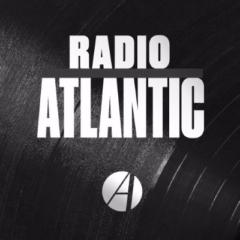
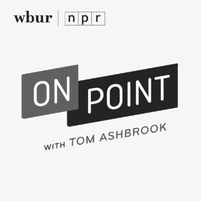
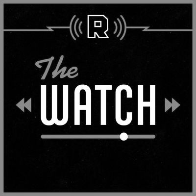
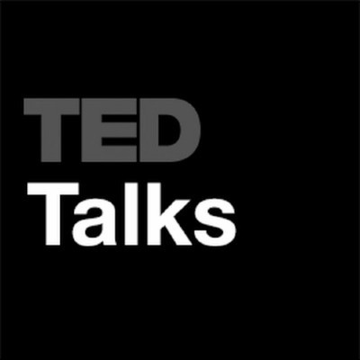

Holy hell, readers, what a week! We were feeling so energized having sent our first newsletter last Friday that we really went deep this week on podcasts. We decided to expand the slate of shows covered, so let us know what you think compared to last week!

The world is an uncertain place, but we found some pretty interesting stuff for you to devour this weekend. First, we did a deep dive on the Hermit Kingdom, North Korea. Then we move on to a few stories about renewable energy prompted by reports that the Russians have been trying to penetrate our energy grid. In lighter fare, since the news broke that J.J. Abrams is returning to direct _Star Wars: Episode IX_, we take you down the rabbit hole of Sci-Fi storytelling. Finally, Hillary Clinton has a new book out, and one of the most interesting things we learned is that apparently SHE LOVES PODCASTS.

As always, like, rate, and subscribe to these podcasts if you enjoy them because it’s absolutely crucial for the creators. Also, please tell everyone you’ve ever met to subscribe to our newsletter! We’ll be incredibly grateful.

### The Hermit Kingdom

The North Korean Kim dynasty has been nothing but enigmatic and Kim Jong Un is no exception. With a [successful test of a nuclear weapon](https://www.vox.com/2017/9/3/16248844/north-korea-nuclear-test-september-3-2017), tensions with the outside world are at an all time high. Somehow Kim Jong Un has successfully brought his vastly undersized and underpowered nation into the global conversation. Understanding North Korea is a Herculean task, but these stories should help you start.

#### Radio Atlantic

### [Mark Bowden on North Korea](https://www.theatlantic.com/international/archive/2017/08/radio-atlantic-news-update-mark-bowden-on-north-korea/536400/)

Given new revelations about North Korea’s nuclear capabilities — and harsh rhetoric from President Trump — _The Atlantic’s_ editors Jeffrey Goldberg and Matt Thompson talk with Mark Bowden on how to deal with North Korea. _\[23:00\]_

#### Undark

### [Healthcare in North Korea](https://undark.org/2017/07/03/undark-podcast-16-health-care-north-korea/)

Join former _NYT Science_ editor David Corcoran as he discusses _Undark_’s case study “Health in the Hermit Kingdom,” about medical problems in refugees from North Korea, with writer Sara Talpos. _\[01:00–18:00\]_

#### This American Life

### [Same Bed, Different Dreams](https://www.thisamericanlife.org/radio-archives/episode/556/same-bed-different-dreams)

Stories of people who are tied together, but imagine radically different futures. In one case, a movie star and her ex-husband plot against Kim Jong-Il. _\[04:00–26:00\]_

### The Energy Grid

Reports surfaced last week that [Russian hackers have infiltrated U.S. utilities](https://www.vox.com/world/2017/9/6/16262198/hackers-us-power-grid-russia) in an effort to potentially cause future blackouts. In a seemingly tangential story, [China is considering banning gas-powered automobiles](https://www.bloomberg.com/news/articles/2017-09-10/china-s-fossil-fuel-deadline-shifts-focus-to-electric-car-race-j7fktx9z). As we transition towards electric cars, we’re effectively building a world with a mobile energy grid focused on renewable energy sources. Here are a collection of stories about these trends.

#### NPR — Fresh Air

### [Experts Suspect Russia Is Using Ukraine As A Cyberwar Testing…](http://www.npr.org/2017/06/22/533951389/experts-suspect-russia-is-using-ukraine-as-a-cyberwar-testing-ground)

_Wired_’s Andy Greenberg says Ukraine has been the victim of a “cyber-assault unlike any the world has ever seen.” Cybersecurity experts think Russia is perfecting attacks that could be used on the U.S. _\[34:00\]_

#### NPR — On Point

### [China’s Day In The Sun And The Future Of The Solar Industry](http://www.wbur.org/onpoint/2017/04/27/china-sun-solar-energy)

China’s out to own the sun. What about the United States? Plus, what we’re doing to protect ourselves from cyberattacks on energy grids. _\[47:00\]_

#### The Energy Gang

### [Autonomous Car Fleets: A Dystopian or Utopian Future?](https://www.greentechmedia.com/articles/read/how-to-stop-autonomous-cars-from-becoming-a-disaster)

On this week’s _Energy Gang_ podcast, we talk with an expert about ensuring that autonomous cars aren’t an environmental, safety and urban planning disaster. _\[01:00–32:00\]_

### A Galaxy Far, Far Away

Disney’s purchase of the _Star Wars_ franchise has breathed new life into one of the most iconic movie franchises of all time. Last week, news broke that the director of Episode IX was leaving the film causing fan uncertainty. In likely the best possible outcome, J.J. Abrams — mastermind behind Episode VII and the _Star Trek_ reboot — [is returning](http://deadline.com/2017/09/jj-abrams-star-wars-episode-9-director-colin-trevorrow-lucasfilm-disney-1202167681/). Abrams’ mastery of storytelling reminds us the importance of mystery and thinking outside the box.

#### The Watch

### [Does It Matter That Star Wars: Episode IX Lost Its Director?](https://www.theringer.com/2017/9/7/16269344/star-wars-episode-ix-director-narcos-twin-peaks-elisabeth-moss)

Chris Ryan and Andy Greenwald discuss director Colin Trevorrow’s sudden departure from _Star Wars_: _Episode IX. \[03:00–13:00\]_

#### TED Talks

### [The Mystery Box](https://www.ted.com/talks/j_j_abrams_mystery_box)

J.J. Abrams traces his love for the unseen mystery –- a passion that’s evident in his films and TV shows, including _Lost_, _Star Trek_ and _Star Wars:_ _Episode VII_ — back to its magical beginnings. _\[18:00\]_

#### StarTalk Radio

### [The Power of Science Fiction With William Shatner](https://www.startalkradio.net/show/power-science-fiction-william-shatner/)

Captain on the bridge: Neil deGrasse Tyson invites Captain Kirk himself, William Shatner, to discuss _Star Trek_ and the enduring power of science fiction. _\[58:00\]_

### What Happened

If you haven’t heard Hillary Clinton wrote a book about the 2016 election, we’re concerned about your exposure to news. There’s hot takes all over the internet, but one thing that definitely surprised us was the number of podcast interviews she lined up to promote her new book. It definitely seems to support the thesis that [podcasts are becoming the left’s right-wing talk radio](https://news.vice.com/story/podcasts-are-becoming-the-lefts-right-wing-talk-radio).

#### Pod Save America

### [Hillary Clinton](https://art19.com/shows/pod-save-america/episodes/de80ea4b-8d9f-4e8a-b1bd-57558c26be76)

This is a political podcast for people not yet ready to give up or go insane hosted by Jon Favreau, Jon Lovett, Dan Pfeiffer and Tommy Vietor. _\[47:00\]_

#### The Ezra Klein Show

### [What Hillary Clinton Really Thinks](https://art19.com/shows/the-ezra-klein-show/episodes/a8135274-838c-4e1d-83ac-95c2b6845e57)

Hillary Clinton’s theory of politics is unfashionable. But she doesn’t care. _\[1:01:00\]_

#### Longform

### [Hillary Clinton](https://longform.org/posts/longform-podcast-261-hillary-clinton)

Hillary Clinton is the former Democratic nominee for president. Her new book is _What Happened_. _\[54:00\]_

### We want to hear from you!

How did you like our suggestions? Which podcast was best? Did you start following any of the shows? Tell us!