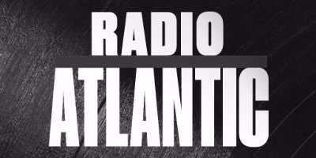
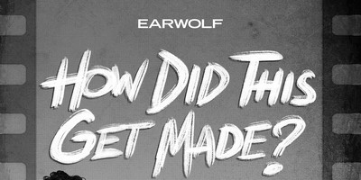
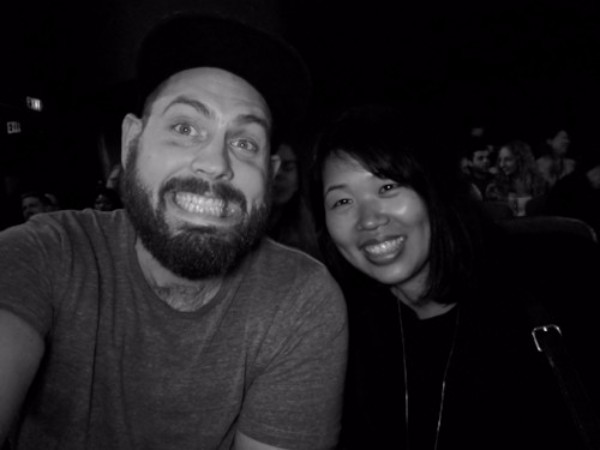

This week is a little different. We’ll be honest, we needed to change up our podcast diet. A bout of sickness and busy work schedule made it a little more difficult than usual to scour the podcast archives, so we turned to our comfort food, our staples, our favorites. We selected six podcasts we really enjoyed so that maybe you can enjoy them this weekend, too!

Have you liked or subscribed to any of the podcasts we’ve recommended? Tell us about it! If you haven’t, get to liking. The medium depends on us showing our love and helping these shows grow. In addition to joining our [Facebook group](https://www.facebook.com/groups/inqueue), please follow us on [Twitter](https://twitter.com/inqueuepodcasts) and like our [Facebook page](https://www.facebook.com/inqueuepodcasts/).

### Happy Listening!

#### The Watch

### [Breaking Down Mindhunter And The Black Panther Trailer](https://www.theringer.com/2017/10/16/16487086/breaking-down-mindhunter-and-the-black-panther-trailer)

Next weekend, we are all going to be binging _Stranger Things_, so while you’ve still got some free time, consider binging _Mindhunter_. While home sick on the couch, I watched this creepy cop show all the way through. I’m a big fan of Chris Ryan and Andy Greenwald’s banter and criticism, so _The Watch_ is always a go to.

Chris and Andy also chat about the recently released _Black Panther_ trailer. While I’m always anticipating Marvel blockbusters, I’m actually more interested in _Black Panther_ after learning Ta-Nehisi Coates is writing for the comic these days. Seriously, check out [this trailer](https://www.youtube.com/watch?v=xjDjIWPwcPU) — it’s amazing — and listen to the podcast. _\[41:36\]_

#### Vox — The Impact

### [A Band-Aid, A $629 ER bill, And A Hard Truth About American Health Care](https://www.vox.com/the-impact/2017/10/16/16387298/band-aid-er-bill-truth-american-health-care)

Sarah Kliff and the _Vox_ team have done an excellent job covering healthcare long before Republicans took control of the federal government. They also have an excellent daily healthcare newsletter: [VoxCare](https://voxmedia.createsend.com/h/d/308D1984CA1062C6).

To round out their amazing coverage, _Vox_ launched a healthcare focused podcast this week and it’s fantastic. The inaugural podcast explores the mystery of medical bills and announces an exciting new project. They are [collecting ER bills](https://erbills.vox.com/) in an effort to create some transparency. _\[23:11\]_

#### New York Times — The Daily

### [Wednesday, Oct. 18, 2017](https://www.nytimes.com/2017/10/18/podcasts/the-daily/factory-jobs.html)

Every morning I start my day with _The Daily_. Typically, I get up and brush my teeth, etc. while Michael Barbaro shares a well-researched story from _The Times_. On Wednesday, I found myself so consumed by his story that I listened to the whole episode before getting out of bed.

The episode centered around Shannon Mulcahy, an Indiana steel worker who lost her job to a factory in Mexico. It’s a painful look at a part of American life I don’t intersect with often, and a reminder of difficult conditions people in the heartland face. _\[36:56\]_

#### HuffPost — I’m Still Here

### [We’re The Bathroom State Now](https://www.huffingtonpost.com/entry/tranzmission-im-still-here-podcast_us_59e4f2c0e4b0a52aca19cc0e)

Speaking of parts of American life we don’t intersect with, some friends of ours over at _HuffPost_ launched a new podcast this week called [_I’m Still Here_](https://www.huffingtonpost.com/entry/introducing-im-still-here-a-new-huffpost-podcast-about-survival_us_59d6707de4b0f6eed34ef6d1). The podcast visits communities whose tales of adversity have put them on the map and explores what “survival” in America really looks like.

In their first episode, _HuffPost_ traveled to North Carolina to cover the persecution a 6-year-old trans girl faced in school and the fight her family put up. Emma’s story is powerful, and we’re excited to see where this series goes. _\[39:40\]_

#### Radio Atlantic

### [Derek Thompson And The Moonshot Factory](https://www.theatlantic.com/technology/archive/2017/10/radio-atlantic-derek-thompson-and-the-moonshot-factory/542850/)

_The Atlantic_ is still pretty new to the podcast game, but they are really starting to find their stride. I really enjoyed this episode on my way to work this week, and am actually already halfway into their latest episode: [Why Do Happy People Cheat?](https://www.theatlantic.com/entertainment/archive/2017/10/radio-atlantic-why-do-happy-people-cheat/543486/)

In Moonshot Factory, Atlantic writer Derek Thompson gets a very rare view inside Google’s secretive R&D Division X. The stories of hiring fashion sewers to stitch internet beaming balloons that self-drive in the stratosphere are fascinating enough, but the dive into how innovation has occured throughout \[American\] history makes this episode all the more worth the listen. _\[49:18\]_

#### How Did This Get Made

### [H](https://www.startalkradio.net/show/cosmic-queries-galactic-gumbo/)[ard Ticket To Hawaii](http://www.earwolf.com/episode/hard-ticket-to-hawaii-live/)

Few people know, but the Bird and Candy journey truly started at the Largo in Los Angeles when we attended the taping of this episode. On Monday, we’re attending our second comedy podcast together: _2 Dope Queens_. Get excited for some ridiculous tweets.

I have to be honest, you should really watch the absolutely atrocious [movie on YouTube](https://www.youtube.com/watch?v=-I-3TY6WXSo) first so you can fully enjoy this podcast. We watched it crying together at a bar; it’s that bad. _\[1:47:34\]_

WHAT’S UP JERKS!  

### We want to hear from you!

How did you like our suggestions? Which podcast was best? Did you start following any of the shows? [Tell us](mailto:birdandcandy@gmail.com?subject=Newsletter%20Suggestion)!

Don’t forget to tell every person you make eye contact with that they should also [sign up for this newsletter](http://eepurl.com/c4m7yT). Also, check out our [archive](http://us15.campaign-archive2.com/home/?u=539f7a4474212160f81ea7b19&id=9eb1e1ec64) if you’ve missed past issues.