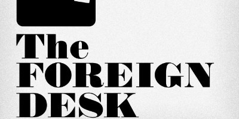
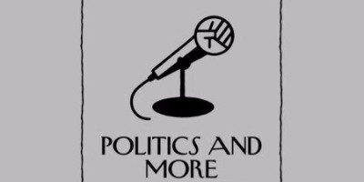
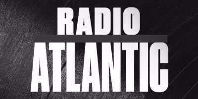
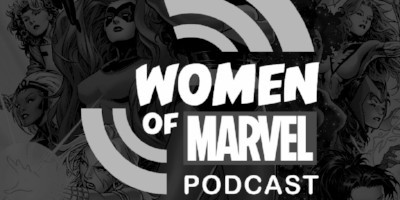

Welcome to Week 5. It’s been trying to comb through audio about heavy events, but we think we’ve found some great perspectives. We’re working on some processes to streamline the discovery of audio, but wanted to give a shout out to the team at [Audiosear.ch](https://www.audiosear.ch/) as they’ve become invaluable to our initial discovery. If you have any strategies for finding new shows or topical episodes, please [reach out to us](mailto:birdandcandy@gmail.com?subject=Discovery)!

We’ll be brief in covering our topics this week. Sunday brought violent clashes over an unsanctioned independence vote in Catalonia, Spain, further highlighting nationaist divisions across the globe. Sunday night, America experienced one of its largest mass shootings in history, a record that seems to be getting broken regularly. On Monday night, rock and roll legend Tom Petty passed away. For our last topic, we cover Ta-Nehisi Coates, whose new book [_We Were Eight Years in Power_](https://www.amazon.com/We-Were-Eight-Years-Power/dp/0399590560/ref=asap_bc?ie=UTF8) came out on Tuesday.

We’ve said it before and we’ll keep saying it: subscribe, rate, share, etc. to these podcasts! The medium depends on us showing your love and helping these shows grow. In addition, we created a [Twitter account](https://twitter.com/inqueuepodcasts) to start engaging directly with you and the creators as well as a [Facebook page](https://www.facebook.com/inqueuepodcasts/). Please follow us so that we can start interacting on a more frequent basis. We even [snapped a picture](https://twitter.com/inqueuepodcasts/status/915702008685920256) of the [Dinner Party Download](https://www.dinnerpartydownload.org/) team recording at Beauty Bar last night.

### Happy Listening!

### Catalonian Independence

Across the globe we’ve seen electoral turmoil surrounding isolationist movements. Last weekend Catalonia was no different as [Spanish federal riot police clashed with local law enforcement](https://www.vox.com/world/2017/10/2/16393956/catalonia-catalan-independence-crackdown-vote-referendum) over an unsanctioned independence vote. Over 700 were injured and yet it seems the American media is largely skipping the story.

To understand global trends, it’s important to look at individual instances and tie them to a broader narrative. _Monocle_ gave a great breakdown of the Catalonian independence movement over a year ago, Yascha Mounk examines the decline of liberal democracy, and Yuval Noah Harari warns of the divide between Nationalism and Globalism.

#### Monocle — The Foreign Desk

### [Why Catalonians Want To Be Independent](https://monocle.com/radio/shows/the-foreign-desk/explainer-27/)

We stumbled upon [_Monocle_](https://monocle.com/) and their suite of podcasts in researching this topic, and almost used three different shows from them. I settled on a brief explainer from _The Foreign Desk_, but would highly recommend exploring their shows. One year ago, they laid out what was happening with the Catalonian separatist movement. _\[6:23\]_

#### Slate — The Good Fight

### [The End Of The West](http://www.slate.com/articles/podcasts/the_good_fight_podcast/2017/08/jamie_kirchick_on_the_dangers_of_dictators_and_demagogues.html)

[Yascha Mounk](http://www.yaschamounk.com/), Lecturer on Political Theory at Harvard, began The Good Fight podcast with Slate to discuss authoritarian populism and what we can do about it. This episode addresses the rise of dictators and similarities between the far-left and far-right across the globe. _\[36:29\]_

#### TED Talks Daily

### [Nationalism vs. Globalism: The New Political Divide](http://www.ynharari.com/nationalism-vs-globalism-the-new-political-divide/)

We found this last podcast on [Radio Public](http://www.radiopublic.com/), but couldn’t find the canonical, so we’re linking to the video. To take the broadest view of how the events in Catalonia and Mounk’s observations about populism, we found this talk by [Yuval Harari](http://www.ynharari.com/about/). It’s an interesting debate on how technology, climate, and media are effecting our divisions. _\[1:00:20\]_

### Guns in America

There’s not much we feel we can say about [Sunday night’s mass shooting](https://www.aol.com/article/news/2017/10/04/at-least-59-dead-more-than-500-injured-in-las-vegas-shooting/23229393/) in Vegas that hasn’t already been said. Gun violence in the US is a known problem, not only in mass homicide but also suicide and domestic assault. This week, we just wanted to find voices of other people talking about the issue.

Regardless of your politics, it’s an appropriate time to reflect. We go to WNYC’s _On The Media_ for a reflection on how the debate has been covered previously, _The New Yorker_ for an interview with an extreme gun enthusiast, and _Call Your Girlfriend_, an unconventional podcast for firearms debate, to hear close friends reflect on the problem of gun violence in the US.

#### WNYC — On The Media

### [The Great Divide](http://www.wnyc.org/story/on-the-media-2016-06-24/)

As regular listeners to _On The Media_ we’ve found their perspective to often times be impartial yet critical. In understanding the gun debate and why we seem to never make progress they don’t disappoint. Last summer, after Democrats staged a sit-in over gun regulation, _On The Media_ put together a detailed look at why it would ultimately be ineffective. _\[53:08\]_

#### The New Yorker — Politics and More

### [Mike Weisser Talks To Evan Osnos About The N.R.A.](https://www.newyorker.com/podcast/political-scene/mike-weisser-talks-to-evan-osnos-about-the-n-r-a)

In the search for diverse perspectives on gun ownership, we came across this _New Yorker_ conversation from last year. Evan Osnos joined the NRA at 11 and has been involved with firearms ever since. One of the best takeaways from this interview is how the NRA has evolved since its inception. _\[22:20\]_

#### Call Your Girlfriend

### [D](http://www.abc.net.au/radionational/programs/backgroundbriefing/2016-08-14/7720904)[on’t Shoot](http://www.callyourgirlfriend.com/episode-56-dont-shoot/)

_Call Your Girlfriend_ isn’t where we thought we’d end up. Typically billed as wine-filled banter, these two friends have a sobering conversation with gun owners, gun reform advocated, and the mother whose son was shot and killed. Even as an undeniably progressive podcast, the hosts do a wonderful job with this divisive subject. _\[1:03:42\]_

### Goodbye Tom Petty

Monday brought more sad news with the [passing of rock icon Tom Petty](https://pitchfork.com/news/tom-petty-is-dead-at-66/). He spanned the music industry for over 40 years, and — like many of his peers — witnessed the music industry’s fundamental shift, away from record sales to streaming.

In dealing with the passing of cultural icons, we’ve found it helpful to hear their perspectives and remember their contributions. For your weekend, we found an interview between Petty and Rolling Stone about his latest tour, a conversation with a Petty biographer, and a decade old conversation with Terry Gross, the queen of interviews.

#### Rolling Stones Music Now

### [Tom Petty on his 2017 tour and his future](http://www.rollingstone.com/music/news/rolling-stone-music-now-podcast-tom-petty-on-new-tour-w458620)

In one of the last interview we could find with Tom Petty, _Rolling Stone_ checks in before he and the Heartbreakers head out on tour. Tom sounds hopeful and excited for his 40-something-th year of performing. It’s an honest — mildly meandering — interview, but for fans of Petty, it will go quickly. _\[47:16\]_

#### Freakonomics Radio

### [Should Everyone Be In A Rock Band?](http://freakonomics.com/podcast/should-everyone-be-in-a-rock-band-a-new-freakonomics-radio-podcast/)

Tom Petty wasn’t an obvious star coming out of Gainesville, and the story of how he became one is interesting. In a conversation with Warren Zanes, _Freakonomics Radio_ takes a look at what makes or breaks a rock band and how Tom Petty navigated the music industy for over 40 years. _\[45:28\]_

#### NPR — Fresh Air

### [Tom Petty Packs 30 Years Of Rock For The Road](http://www.npr.org/2006/07/27/5586675/tom-petty-packs-30-years-of-rock-for-the-road)

Few people can interview as well as Terry Gross. In a closing rememberance of Tom Petty’s music, we look back at their conversation 11 years ago, the 30th anniversary of Tom Petty and the Heartbreakers. _\[38:48\]_

### Ta-Nehisi Coates

Race relations have been especially in focus lately with events like White Supremacist rallies and political dismissal of protest over the disproportional killing of young black men. If you haven’t heard of [Ta-Nehisi Coates](https://en.wikipedia.org/wiki/Ta-Nehisi_Coates), he’s one of the most powerful voices addressing America’s race divide.

Ta-Nehisi was [on Colbert](https://www.youtube.com/watch?v=X-xssa4BHuI) this past week offering sobering critiques of our current political climate and we felt it prescient to surface some interviews with this brilliant man. Listen to him talk about his life, his response to Charlottesville, and — unbeknownst to us — his experience writing the new Black Panther comics.

#### New Yorker — Out Loud

### [Ta-Nehisi Coates In Conversation](https://www.newyorker.com/podcast/out-loud/bonus-ta-nehisi-coates)

Two years ago, Ta-Nehisi Coates [wrote about reparations](https://www.theatlantic.com/magazine/archive/2014/06/the-case-for-reparations/361631/) for _The Atlantic_. To provide context about the author, David Remnick interviewed him about his life and career. This is the shortest, most accessible conversation we could find with Ta-Nehisi, but in searching for podcasts with him, we’ve learned to stop and listen whenever he talks. _\[31:16\]_

#### Radio Atlantic

### [T](https://www.theatlantic.com/national/archive/2017/08/radio-atlantic-ta-nehisi-coates-and-yoni-appelbaum-on-charlottesvilles-aftermath/537288/)[he Miseducation Of Ta-Nehisi Coates](https://www.theatlantic.com/personal/archive/2017/10/radio-atlantic-the-miseducation-of-ta-nehisi-coates/542232/)

In his new book, [_We Were Eight Years in Power_](https://www.amazon.com/We-Were-Eight-Years-Power/dp/0399590560/ref=asap_bc?ie=UTF8), Coates writes about the past eight years of his career — his pursuit of an understanding of America, and his route to becoming a celebrated author. In this podcast, other _Atlantic_ staff conducted three separate interviews about three different periods of his life. _\[1:24:04\]_

#### Women of Marvel

### [Voices Of Marvel With Ta-Nehisi Coates](https://soundcloud.com/marvel/women-of-marvel-podcast-ep-90-voices-of-marvel-with-ta-nehisi-coates)

We also wanted to shed light on something new we learned about Ta-Nehisi — he’s the author of new and different Black Panther comics. While we probably won’t be listening to _Women of Marvel_ often because it’s a bit outside our wheelhouse, this conversation was fascinating not only because of the subject matter, but also because of the voices on it. It was a reminder of how open podcasting can be for the less-heard. _\[47:32\]_

### We want to hear from you!

How did you like our suggestions? Which podcast was best? Did you start following any of the shows? [Tell us](mailto:birdandcandy@gmail.com?subject=Newsletter%20Suggestion)!

Don’t forget to tell every person you make eye contact with that they should also [sign up for this newsletter](http://eepurl.com/c4m7yT). Also, check out our [archive](http://us15.campaign-archive2.com/home/?u=539f7a4474212160f81ea7b19&id=9eb1e1ec64) if you’ve missed past issues.