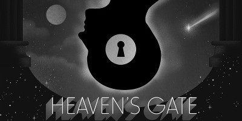
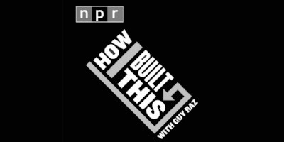
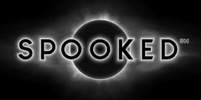
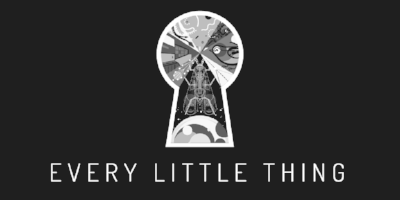

Welcome to Week 8. We got quite a few positive responses after changing up last week’s newsletter format and the open rate was 2x higher, so we’re going to continue that and see how it goes! Given it’s Halloween weekend, we found a few _spooky_ podcasts and mixed in some of our other favorite episodes this week.

We also saw _2 Dope Queens_ live on Monday as part of their filming for their HBO special. They did not disappoint! If you need something to make you laugh this weekend, check out [their archive](http://www.wnyc.org/shows/dopequeens) to hear their banter and sample some underrepresented comedians.

Have you liked or subscribed to any of the podcasts we’ve recommended? Tell us about it! If you haven’t, get to liking. The medium depends on us showing your love and helping these shows grow. In addition to joining our Facebook group, please follow us on [Twitter](https://twitter.com/inqueuepodcasts) and like our [Facebook page](https://www.facebook.com/inqueuepodcasts/).

### Happy Listening!

#### My Favorite Murder

### [The Halloween Special](https://www.myfavoritemurder.com/)

This week opens with crowd-favorite _My Favorite Murder_. If you haven’t heard of this breakout show, friends Karen Kilgariff and Georgia Hardstark spend well over an hour talking about their lives and often times joking about gruesome murders they’ve investigated. The week, they decided to read fan submitted stories together. _\[1:18:48\]_

#### 99% Invisible

### [P](http://www.wnyc.org/story/red-cross-and-its-detractors/)[erson in Lotus Position](https://99percentinvisible.org/episode/person-lotus-position/)

Candy deserves credit for finding this one. We’ve referenced _99% Invisible_ in the past, but often times let the un-listened episodes pile up. Want to learn how an emoji becomes an emoji? Mark Bramhill tells the story of getting his emoji approved. Keep your eyes peeled, Candy wants to get an emoji made too! _\[32:48\]_

#### Heaven’s Gate

### [T](https://mic.com/articles/184561/charity-navigator-explains-how-to-avoid-scams-vet-organizations-and-make-sure-your-donations-count#.oUmsifQUS)[he Seekers](https://www.heavensgate.show/#listen-section)

_Heaven’s Gate_ is the second podcast from the team that made _Missing Richard Simmons_. This series is about a cult that committed mass-suicide in San Diego. Glynn Washington of _Snap Judgment_ takes listeners on a journey to understand the largest mass-suicide in US history. There’s only two episodes out so far, and we definitely were more hooked after the second. Give this eerie show a chance. _\[35:43\]_

#### How I Built This

### [Burton Snowboards](http://www.npr.org/podcasts/510313/how-i-built-this)

This podcast was completely for Bird. He grew up snowboarding, and always wanted to ride a Burton because they were the coolest. Founder Jake Carpenter tells the story of the company’s last 40 years. We knew we wanted to tell you all about it after Jake addressed the need to have female leadership. This episode gave us a lot more respect for Burton. _\[46:49\]_

#### WNYC — Spooked

### [The Watcher](http://www.wnyc.org/story/watcher/)

WNYC and _Snap Judgement_ (yes, Glynn Washington got two podcasts on the list today) teamed up to tell scary stories for Halloween. To be honest, _The Watcher_ hasn’t been my favorite episode they’ve made, but it’s the first of the series _and_ the audio production on the last story was so eerie, we felt like it’s a good gateway to the limited run show. Don’t listen before bed… _\[38:08\]_

#### Every Little Thing

### [6 O’Clock Soundclock](https://gimletmedia.com/episode/six-oclock-soundtrack/)

Close out your listening this week by learning how news scores are made. You read that right, Gimlet’s _Every Little Thing_ spoke to the guy that runs [NetworkNewsMusic.com](http://www.networknewsmusic.com/wp/) — a real website — about all things news jingles, including him running a marathon to these musical compositions: the most listened to music we never think about. _\[24:20\]_

### We want to hear from you!

How did you like our suggestions? Which podcast was best? Did you start following any of the shows? [Tell us](mailto:birdandcandy@gmail.com?subject=Newsletter%20Suggestion)!

Don’t forget to tell every person you make eye contact with that they should also [sign up for this newsletter](http://eepurl.com/c4m7yT). Also, check out our [archive](http://us15.campaign-archive2.com/home/?u=539f7a4474212160f81ea7b19&id=9eb1e1ec64) if you’ve missed past issues.