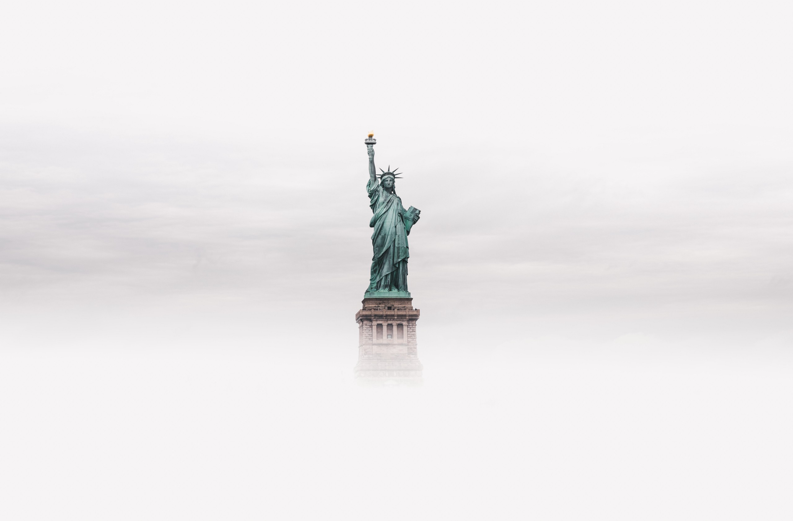

I imagine many of you have never entered a gay bar; that’s okay! To be frank, my experiences in gay bars have all occurred in the Chili’s Era. My nostalgia of gay bars is of an idyllic time I never witnessed, but rather has been regaled to me by men who survived police beatings and the AIDS crisis, by men who were told they could never marry or be open at work for fear of harassment and termination. I would never suggest we revert those advancements, but alongside the progress of the LGBTQ community has seen, we’ve also seen a decay of social structures in the name of efficiency. Walk into a Chili’s and you’re greeted not by waitstaff, but by a tablet optimized to your every need.

> _“Give me your tired, your poor,_

> _Your huddled masses yearning to breathe free,_

> _The wretched refuse of your teeming shore._

> _Send these, the homeless, tempest-tossed to me,_

> _I lift my lamp beside the golden door!”_

We’ve been told we have an immigration crisis, that it’s more important to close our doors than to give a home to the tired and poor. This is a crisis of identity, a crisis of purpose, and a crisis of our future. America’s history is — at best — checkered, but our queer communities are a bright spot of inclusion and intersectionality. You see, for centuries, America’s congregation spaces were largely for homogeneous populations, but homosexual spaces never had the _privilege_ to be homogeneous; we accepted those yearning to breathe free when nobody else would. Though American, homosexuals are often viewed as our wretched refuse, just ask Mike Pence.

It wasn’t so long ago that Mike Pence was in the vocal majority and that places like Stonewall, now a national landmark, were havens from the hatred of the Pence coalition. These gay bars used to serve many purposes. Today, they’ve become less efficient versions of the latest app on our phone. Gay bars were our Tinder, but they were also our ZocDoc, and our StreetEasy, and our Yelp. They were our Google, and our Facebook, and our Twitter. By entering the gay bars of ages past, you were signing a similarly opaque Terms and Services, but in exchange you found an diverse community largely invested in protecting and elevating itself in the world. It’s hard to imagine that Tinder or Grindr have my community’s best interest in mind.

And today… don’t like your Big Mouth Bites? Tweet abusively @Chilis and some underpaid employee sitting in a dimly lit office will offer you a gift card. We don’t even need women with that particular haircut to speak to managers anymore; why waste time on a real interaction when you can attack a faceless person representing a corporation 280 characters at a time. Take a moment and soak it all up. Maybe you were wowed by the convenience of your omnicapable tablet, but if you look up from your 32oz Coke, you’ll likely be equally wowed by how bland and isolating the experience has become. The atomizaton of tasks, the removal of human interaction for the sake of efficiency, it’s all created a world so sterile we’re suffering an epidemic of loneliness.

We’ve been promised a more luxurious life, an easier life, a happier life if we would just embrace a singular identity. The promise of cheap, easy, unoffensive dining sounds like a grand idea, but I ask you to consider what is lost when every problem is solved by an app on a tablet or when we forget the homeless and tempest-tossed in order to build a new hotel. Did gay bars close their golden doors when the world left them to die of AIDS? No, they lifted their lamps, the lamp that symbolizes America and they bore pain and suffering, they invited anybody inside, and they fought for a better tomorrow.

Open your doors, lift your lamps, and stop going to Chili’s.