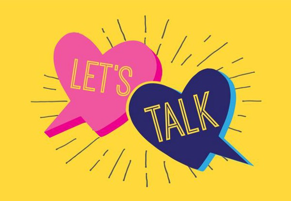

PrEP–Pre-exposure Prophylaxis–commonly refers to drugs taken before exposure to prevent HIV infections. In France, they’ve begun trials for a [proactive medication regimen to prevent syphilis](http://www.aidsmap.com/news/feb-2017/experimental-sti-prophylaxis-prep-users-produces-big-drops-syphilis-and-chlamydia); they’re also referring to it as PrEP. This raises an important question, if PrEP can prevent syphilis and HIV, but are different protocols, what then is PrEP?

Scientific advances have started to free a generation of gay men from the shackles of the historic trauma of the AIDS Crisis. For many people, Truvada has replaced other forms of responsibility adopted during the epidemic. Expanding our definitions of PrEP is critical to further empowering and protecting our most vulnerable.

> **pro·phy·lax·is**

> `/ˌprōfəˈlaksəs/`

> noun

> action taken to prevent disease, especially by specified means or against a specified disease.

Does Truvada prevent HIV? [Absolutely](https://www.cdc.gov/hiv/basics/prep.html).

Does doxycycline prevent syphilis? [Results are promising](http://www.aidsmap.com/news/feb-2017/experimental-sti-prophylaxis-prep-users-produces-big-drops-syphilis-and-chlamydia).

Do condoms prevent STIs? [Yup](https://www.cdc.gov/condomeffectiveness/brief.html).

You know what else reduces STIs — [talking about sexual health](https://www.ncbi.nlm.nih.gov/pmc/articles/PMC5763398/).

Taken at its most literal definition, pre-exposure prophylaxis is simply any preventative action taken before potentially being exposed to a pathogen. For the sake of this diatribe, I’ll keep PrEP discussions focused on sex, because hand sanitizer doesn’t really help alleviate sexual shame.

By broadening our definition, we can create a spectrum of practices that fall under PrEP. Talking with your partner about sexual history, putting on a condom, using lube, and taking Truvada regularly can all reduce the chances of contracting an STI.

In fact, our definition of PEP–Post-exposure Prophylaxis–should evolve too to include getting tested, taking medication, and notifying partners. When we’re anxious, it can be difficult to know what to do, which means professional healthcare providers have work to do in making patients feel comfortable and safe in the moment.

> **What do I say when asked if I’m on PrEP?**

> I say that I take Truvada daily, I get screened quarterly, and I share the number of partners I’ve had recently. I’m confident and PrEPared to love.

Being PrEPared is a spectrum. Some Truvada patients choose not to use any other prevention techniques, others incorporate a multitude. Some people aren’t on Truvada, and rely on condoms to protect themselves and their community. One thing is universally true, we don’t talk about sexual wellness enough.

Today, my company–Kalamos Care–packages condoms and lube with Truvada (or Descovy) prescriptions. Our true mission is to empower everyone love freely, regardless of gender or sexuality. That means not only making it easier to get safer-sex supplies, but also lowering social stigma around being sexually active. We’ve barely taken our first step, but we’re excited for the journey.